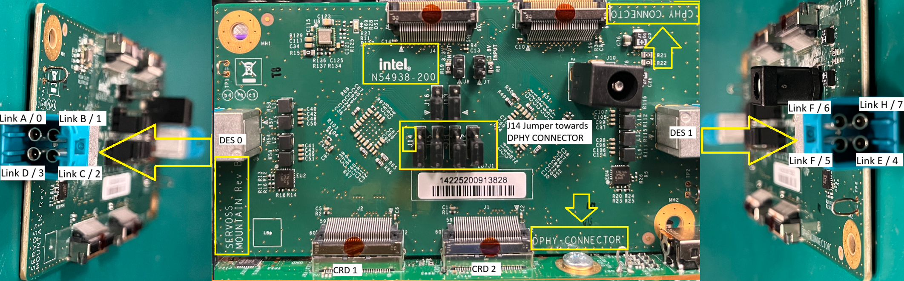
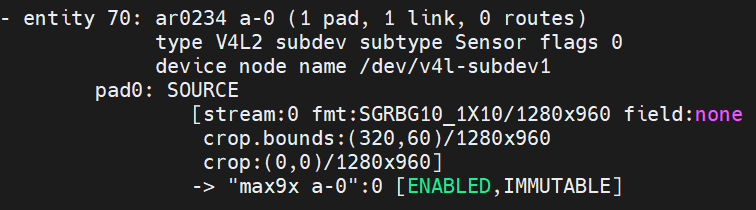

## Description

This document details the configuration settings for the AR0234 GMSL sensor, providing essential information for system integration. The table below presents the key parameters and their respective values used during system setup and validation.

<!-- TABLE OF CONTENTS -->

  
Table of Contents

  <ol>
    <li><a href="#hardware-connection">Hardware Connection</a>
      <ul>
        <li><a href="#max9296-aic-rev-b-connection">MAX9296 AIC (REV B) Connection</a></li>
        <li><a href="#max96724-aic-c-phy-rev-a-connection">MAX96724 AIC (C-PHY) (REV A) Connection</a></li>
        <li><a href="#max96724-aic-c-phy-rev-b-connection">MAX96724 AIC (C-PHY) (REV B) Connection</a></li>
        <li><a href="#max96724-aic-d-phy-rev-b-connection">MAX96724 AIC (D-PHY) (REV B) Connection</a></li>
        <li><a href="#max96724-aic-c-phy-to-d-phy-adapter-rev-b-connection">MAX96724 AIC (C-PHY to D-PHY Adapter) (REV B) Connection</a></li>
      </ul>
    </li>
    <li><a href="#bios-configuration-table">BIOS Configuration Table</a>
      <ul>
        <li><a href="#disable-c-states">Disable C States</a></li>
      </ul>
    </li>
    <li><a href="#mipi-camera-configuration">MIPI Camera Configuration</a>
      <ul>
        <li><a href="#setup-for-ipu6epmtl">Setup for IPU6EPMTL</a></li>
        <li><a href="#setup-for-ipu75xa">Setup for IPU75XA</a></li>
      </ul>
    </li>
    <li><a href="#camera-configuration-file-setup">Camera Configuration File Setup</a>
      <ul>
        <li><a href="#setup-for-ipu6epmtl-1">Setup for IPU6EPMTL</a></li>
        <li><a href="#setup-for-ipu75xa-1">Setup for IPU75XA</a></li>
      </ul>
    </li>
    <li><a href="#camera-tuning-file-setup">Camera Tuning File Setup</a>
      <ul>
        <li><a href="#setup-for-ipu6epmtl-2">Setup for IPU6EPMTL</a></li>
        <li><a href="#setup-for-ipu75xa-2">Setup for IPU75XA</a></li>
      </ul>
    </li>
    <li><a href="#environment-setup">Environment Setup</a></li>
    <li><a href="#sensor-verification">Sensor Verification</a></li>
    <li><a href="#sample-userspace-command">Sample Userspace Command</a></li>
    <li><a href="#streaming-result">Streaming Result</a></li>
  </ol>

## Hardware Connection

This section describes the physical AIC (Add-In Card) hardware setup, including link port layout and jumper configurations for MIPI PHY selection.

#### MAX9296 AIC (REV B) Connection

> **Note:** Samtec cables and an external power supply are required to connect the MAX9296 AIC to the baseboard.

#### MAX96724 AIC (C-PHY) (REV A) Connection

> **Note:** The MAX96724 AIC (REV A) supports only C-PHY connections, selectable via the J14 jumper highlighted in the image below.

#### MAX96724 AIC (C-PHY) (REV B) Connection

> **Note:** The MAX96724 AIC (REV B) supports both C-PHY and D-PHY connections, selectable via the J14 jumper.

Image below shows the C-PHY setup.

#### MAX96724 AIC (D-PHY) (REV B) Connection

> **Note:** Ensure the J14 jumper pins are oriented toward the D-PHY connector, as shown in the image below.

Image below shows the D-PHY setup.

#### MAX96724 AIC (C-PHY to D-PHY Adapter) (REV B) Connection

Image below shows the C-PHY to D-PHY adapter setup.

## BIOS Configuration Table

> **Note:** No External Clock required.

#### Disable C States

Config path: `Intel Advanced Menu`->`Power & Performance`->`CPU - Power Management Control`

|                            | Options              |
|---                         |---                   |
| C states                   | Disabled             |

> **Note:** This option is only applicable for IPU6EP platforms (ADL, TWL, ASL and RPL).

## MIPI Camera Configuration

#### Setup for IPU6EPMTL

Config path: `Intel Advanced Menu`->`System Agent (SA) Configuration`->`MIPI Camera Configuration`

Click to expand BIOS camera link options

|                            | Camera1 Link options |
|---                         |---                   |
| Sensor Model               | User Custom          |
| Custom HID                 | INTC0234             |
| Lanes Clock division       | 4 4 2 2              |
| CRD Version                | CRD-D                |
| GPIO control               | No Control Logic     |
| Camera position            | Front                |
| Flash Support              | Driver default       |
| Privacy LED                | Driver default       |
| Rotation                   | 90                   |
| PPR Value                  | 2                    |
| PPR Unit                   | 2                    |
| Camera module name         |                      |
| MIPI port                  | 0                    |
| LaneUsed                   | x2                   |
| MCLK                       | 19200000             |
| EEPROM Type                | ROM_NONE             |
| VCM Type                   | VCM_NONE             |
| Number of I2C Components   | 3                    |
| I2C Channel                | I2C1                 |
| Device 0                   |                      |
| I2C Address                | 48                   |
| Device Type                | Sensor               |
| Device 1                   |                      |
| I2C Address                | 44                   |
| Device Type                | Sensor               |
| Device 2                   |                      |
| I2C Address                | 50                   |
| Device Type                | Sensor               |
| Customize Device ID List   |                      |
| Customize Device ID Number | 17                   |
| Customize Device ID Number | 18                   |
| Customize Device ID Number | 19                   |
| Flash Driver Selection     | Disabled             |

#### Setup for IPU75XA

> **Note:** Configuration is performed using SSDT ACPI method based on [MAX96724 AIC (C-PHY) (REV A) Connection](#max96724-aic-c-phy-rev-a-connection). Please visit 'Compile and Load ACPI ASL source' in [acpi](../acpi/kernelspace.md) for setup guideline.

    cd ../../acpi/ipu7
    ../../script/gen_ssdt.sh max96724_d3_ar0234.asl

## Camera Configuration File Setup

#### Setup for IPU6EPMTL

Replace target system with recommended [ipu6epmtl](../../config/ar0234/ipu6epmtl) setting

> **Note:** Add config below only if using x2 GMSL sensors.

    sudo cp -r ../../config/ar0234/ipu6epmtl /etc/camera
    sudo sed -i '/availableSensors/c\        <availableSensors value="ar0234"/>' /etc/camera/ipu6epmtl/libcamhal_profile.xml

#### Setup for IPU75XA

Replace target system with recommended [ipu75xa](../../config/ar0234/ipu75xa) setting

    sudo cp -r ../../config/ar0234/ipu75xa /etc/camera
    ../../script/acpi/mc-setup.sh

## Camera Tuning File Setup

#### Setup for IPU6EPMTL

Import [AR0234_TGL_10bits.aiqb](https://github.com/intel/ipu6-camera-hal/blob/iotg_ipu6/config/linux/ipu6epmtl/AR0234_TGL_10bits.aiqb) into target system `/etc/camera/ipu6epmtl`

#### Setup for IPU75XA

> **TODO:** No action needed for now, will revisit once AIQB config available in [ipu7-camera-hal](https://github.com/intel/ipu7-camera-hal/tree/main/config/linux/ipu75xa).

## Environment Setup

> **Note:** PSYS library requires superuser access, please login as root to run the sample commands given below.

Export environment variables below

    unset XDG_RUNTIME_DIR
    export DISPLAY=:0; xhost +
    export GST_PLUGIN_PATH=/usr/lib/gstreamer-1.0
    export LIBVA_DRIVER_NAME=iHD
    export GST_GL_API=gles2
    export GST_GL_PLATFORM=egl
    export LIBVA_DRIVERS_PATH=/usr/lib/x86_64-linux-gnu/dri
    export PKG_CONFIG_PATH=/usr/local/lib/pkgconfig:/usr/lib64/pkgconfig:/usr/lib/pkgconfig
    export LD_LIBRARY_PATH=/usr/local/lib/pkgconfig:/usr/local/lib:/usr/lib64:/usr/lib:/usr/lib/x86_64-linux-gnu
    export logSink=terminal
    rm -rf ~/.cache/gstreamer-1.0

(Required for IPU6 only) Configure isys_freq value

    sudo bash -c 'echo "options intel-ipu6 isys_freq_override=475" >> /etc/modprobe.d/ipu.conf'

## Sensor Verification

Upon setup completion, verify sensor with:

    media-ctl -p

## Sample Userspace Command

> **Note:** PSYS library requires superuser access, please login as root to run the sample commands given below.

> **Attention:** If target is setup using BIOS MIPI Camera Configuration, please replace 'device-name' format in sample commands below from 'ar0234_acpi-' to 'ar0234-'. For example, 'ar0234_acpi-1' become 'ar0234-1'.

#### Sensor Device Selection

| Sensor Number | Command Pipeline |
|---|---|
| 1 | gst-launch-1.0 icamerasrc num-buffers=-1 num-vc=1 scene-mode=normal device-name=ar0234_acpi-1 printfps=true io-mode=dma_mode ! 'video/x-raw(memory:DMABuf),drm-format=NV12,width=1280,height=960' ! glimagesink sync=false |
| 2 | gst-launch-1.0 icamerasrc num-buffers=-1 num-vc=1 scene-mode=normal device-name=ar0234_acpi-2 printfps=true io-mode=dma_mode ! 'video/x-raw(memory:DMABuf),drm-format=NV12,width=1280,height=960' ! glimagesink sync=false |

> **Note**: Refer to icamerasrc device-name property for more sensor details.

##### How to relate Sensor Number with AIC Link Port

Refer to MAX9296 or MAX96724 AIC under [Hardware Connection](#hardware-connection), select the correct sensor number based on the physical AIC link port layout.

| AIC Link Port | Sensor Number |
|---            |---            |
| A             | 1             |
| B             | 2             |

#### Frame Buffer Memory Type (IO Mode) Selection

| IO Mode | Command Pipeline |
|---|---|
| USERPTR | gst-launch-1.0 icamerasrc num-buffers=-1 num-vc=1 scene-mode=normal device-name=ar0234_acpi-1 printfps=true io-mode=userptr ! 'video/x-raw,format=NV12,width=1280,height=960' ! glimagesink sync=false |
| DMA MODE | gst-launch-1.0 icamerasrc num-buffers=-1 num-vc=1 scene-mode=normal device-name=ar0234_acpi-1 printfps=true io-mode=dma_mode ! 'video/x-raw(memory:DMABuf),drm-format=NV12,width=1280,height=960' ! glimagesink sync=false |

> **Note**: Refer to icamerasrc io-mode property for more sensor details.

#### Sensor Resolution Selection

| Resolution | Command Pipeline |
|---|---|
| 1280x960 | gst-launch-1.0 icamerasrc num-buffers=-1 num-vc=1 scene-mode=normal device-name=ar0234_acpi-1 printfps=true io-mode=dma_mode ! 'video/x-raw(memory:DMABuf),drm-format=NV12,width=1280,height=960' ! glimagesink sync=false |

#### Sensor Format Selection

| Format | Command Pipeline |
|---|---|
| NV12 | gst-launch-1.0 icamerasrc num-buffers=-1 num-vc=1 scene-mode=normal device-name=ar0234_acpi-1 printfps=true io-mode=dma_mode ! 'video/x-raw(memory:DMABuf),drm-format=NV12,width=1280,height=960' ! glimagesink sync=false |

#### Number of Stream (Single Stream / Multi Stream) Selection

| Number of Stream | Command Pipeline |
|---|---|
| x1 | gst-launch-1.0 icamerasrc num-buffers=-1 num-vc=1 scene-mode=normal device-name=ar0234_acpi-1 printfps=true io-mode=dma_mode ! 'video/x-raw(memory:DMABuf),drm-format=NV12,width=1280,height=960' ! glimagesink sync=false |
| x2 | gst-launch-1.0 icamerasrc num-buffers=-1 num-vc=2 scene-mode=normal device-name=ar0234_acpi-1 printfps=true io-mode=dma_mode ! 'video/x-raw(memory:DMABuf),drm-format=NV12,width=1280,height=960' ! glimagesink sync=false icamerasrc num-buffers=-1 num-vc=2 scene-mode=normal device-name=ar0234_acpi-2 printfps=true io-mode=dma_mode ! 'video/x-raw(memory:DMABuf),drm-format=NV12,width=1280,height=960' ! glimagesink sync=false |

## Streaming Result

| Number of Stream | IO Mode  | FPS Result |
|---               |---       |---         |
| x1               | USERPTR  | 30         |
| x1               | DMA MODE | 30         |
| x2               | USERPTR  | 30         |
| x2               | DMA MODE | 30         |

> **Note:** Please ensure your system enable support for specified number of stream before test.

---

[↑ Back to Top](#description)
