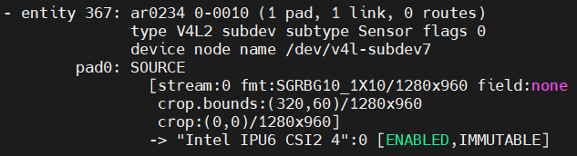

## Description

This document details the configuration settings for the AR0234 MIPI CSI-2 sensor, providing essential information for system integration. The table below presents the key parameters and their respective values used during system setup and validation.

## BIOS Configuration Table

> **Note:** No External Clock required.

### MIPI Camera Configuration for IPU6EPMTL

Config path: `Intel Advanced Menu`->`System Agent (SA) Configuration`->`MIPI Camera Configuration`

|                            | Control Logic 1      | Control Logic 2      |
|---                         |---                   | ---                  |
| Control Logic Type         | Discrete             | Discrete             |
| Number of GPIOs            | 1                    | 1                    |
| Group Pad Number           | 23                   | 0                    |
| Group Number               | D_E_F_V              | A_B_H_S              |
| Com Number                 | COM0                 | COM3                 |
| Function                   | RESET                | RESET                |
| Active Value               | 1                    | 1                    |
| Initial Value              | 1                    | 1                    |

|                            | Camera1 Link options | Camera2 Link options |
|---                         |---                   | ---                  |
| Sensor Model               | User Custom          | User Custom          |
| Custom HID                 | INTC10C0             | INTC10C0             |
| Lanes Clock division       | 4 4 2 2              | 4 4 2 2              |
| CRD Version                | CRD-D                | CRD-D                |
| GPIO control               | Control Logic 1      | Control Logic 2      |
| Camera position            | Front                | Back                 |
| Flash Support              | Disabled             | Disabled             |
| Privacy LED                | Driver default       | Driver default       |
| Rotation                   | 0                    | 0                    |
| PPR Value                  | 2                    | 2                    |
| PPR Unit                   | 2                    | 2                    |
| Camera module name         | _                    | _                    |
| MIPI port                  | 0                    | 4                    |
| LaneUsed                   | x2                   | x2                   |
| MCLK                       | 19200000             | 19200000             |
| EEPROM Type                | ROM_NONE             | ROM_NONE             |
| VCM Type                   | VCM_NONE             | VCM_NONE             |
| Number of I2C Components   | 1                    | 1                    |
| I2C Channel                | I2C1                 | I2C0                 |
| Device 0                   |                      |                      |
| I2C Address                | 10                   | 10                   |
| Device Type                | Sensor               | Sensor               |
| Customize Device ID List   |                      |                      |
| Customize Device ID Number | 17                   | 17                   |
| Customize Device ID Number | 18                   | 18                   |
| Customize Device ID Number | 19                   | 19                   |
| Flash Driver Selection     | Disabled             | Disabled             |

## Camera Configuration File Setup

#### Setup for IPU6EPMTL

Replace target system with recommended [ipu6epmtl](../../config/ar0234/ipu6epmtl) setting

> **Note:** Add config below only if using x2 MIPI sensors.

    sudo cp -r ../../config/ar0234/ipu6epmtl /etc/camera
    sudo sed -i '/availableSensors/c\        <availableSensors value="ar0234-1-mipi-0,ar0234-2-mipi-4"/>' /etc/camera/ipu6epmtl/libcamhal_profile.xml

## Camera Tuning File Setup

#### Setup for IPU6EPMTL

Import [AR0234_TGL_10bits.aiqb](https://github.com/intel/ipu6-camera-hal/blob/iotg_ipu6/config/linux/ipu6epmtl/AR0234_TGL_10bits.aiqb) into target system `/etc/camera/ipu6epmtl`

## Environment Setup

> **Note:** PSYS library requires superuser access, please login as root to run the sample commands given below.

Export environment variables below

    export DISPLAY=:0; xhost +
    export GST_PLUGIN_PATH=/usr/lib/gstreamer-1.0
    export LIBVA_DRIVER_NAME=iHD
    export GST_GL_API=gles2
    export GST_GL_PLATFORM=egl
    export LIBVA_DRIVERS_PATH=/usr/lib/x86_64-linux-gnu/dri
    export PKG_CONFIG_PATH=/usr/local/lib/pkgconfig:/usr/lib64/pkgconfig:/usr/lib/pkgconfig
    export LD_LIBRARY_PATH=/usr/local/lib/pkgconfig:/usr/local/lib:/usr/lib64:/usr/lib:/usr/lib/x86_64-linux-gnu
    export logSink=terminal
    rm -rf ~/.cache/gstreamer-1.0

(Required for IPU6 only) Configure isys_freq value

    sudo bash -c 'echo "options intel-ipu6 isys_freq_override=475" >> /etc/modprobe.d/ipu.conf'

## Sensor Verification

Upon setup completion, verify sensor with:

    media-ctl -p

## Sample Userspace Command

> **Note:** PSYS library requires superuser access, please login as root to run the sample commands given below.

#### Sensor Device Selection

| MIPI Port | Command Pipeline |
|---|---|
| CRD1 | gst-launch-1.0 icamerasrc num-buffers=-1 scene-mode=normal device-name=ar0234-1 printfps=true io-mode=dma_mode ! 'video/x-raw(memory:DMABuf),drm-format=NV12,width=1280,height=960' ! glimagesink sync=false |
| CRD2 | gst-launch-1.0 icamerasrc num-buffers=-1 scene-mode=normal device-name=ar0234-2 printfps=true io-mode=dma_mode ! 'video/x-raw(memory:DMABuf),drm-format=NV12,width=1280,height=960' ! glimagesink sync=false |

> **Note**: Refer to icamerasrc device-name property for more sensor details.

#### Frame Buffer Memory Type (IO Mode) Selection

| IO Mode | Command Pipeline |
|---|---|
| USERPTR | gst-launch-1.0 icamerasrc num-buffers=-1 scene-mode=normal device-name=ar0234-1 printfps=true io-mode=userptr ! 'video/x-raw,format=NV12,width=1280,height=960' ! glimagesink sync=false |
| DMA MODE | gst-launch-1.0 icamerasrc num-buffers=-1 scene-mode=normal device-name=ar0234-1 printfps=true io-mode=dma_mode ! 'video/x-raw(memory:DMABuf),drm-format=NV12,width=1280,height=960' ! glimagesink sync=false |

> **Note**: Refer to icamerasrc io-mode property for more sensor details.

#### Sensor Resolution Selection

| Resolution | Command Pipeline |
|---|---|
| 1280x960 | gst-launch-1.0 icamerasrc num-buffers=-1 scene-mode=normal device-name=ar0234-1 printfps=true io-mode=dma_mode ! 'video/x-raw(memory:DMABuf),drm-format=NV12,width=1280,height=960' ! glimagesink sync=false |

#### Sensor Format Selection

| Format | Command Pipeline |
|---|---|
| NV12 | gst-launch-1.0 icamerasrc num-buffers=-1 scene-mode=normal device-name=ar0234-1 printfps=true io-mode=dma_mode ! 'video/x-raw(memory:DMABuf),drm-format=NV12,width=1280,height=960' ! glimagesink sync=false |

#### Number of Stream (Single Stream / Multi Stream) Selection

| Number of Stream | Command Pipeline |
|---|---|
| x1 | gst-launch-1.0 icamerasrc num-buffers=-1 scene-mode=normal device-name=ar0234-1 printfps=true io-mode=dma_mode ! 'video/x-raw(memory:DMABuf),drm-format=NV12,width=1280,height=960' ! glimagesink sync=false |
| x2 | gst-launch-1.0 icamerasrc num-buffers=-1 scene-mode=normal device-name=ar0234-1 printfps=true io-mode=dma_mode ! 'video/x-raw(memory:DMABuf),drm-format=NV12,width=1280,height=960' ! glimagesink sync=false icamerasrc num-buffers=-1 scene-mode=normal device-name=ar0234-2 printfps=true io-mode=dma_mode ! 'video/x-raw(memory:DMABuf),drm-format=NV12,width=1280,height=960' ! glimagesink sync=false |

## Streaming Result

| Number of Stream | IO Mode  | FPS Result |
|---               |---       |---         |
| x1               | USERPTR  | 30         |
| x1               | DMA MODE | 30         |
| x2               | USERPTR  | 30         |
| x2               | DMA MODE | 30         |
