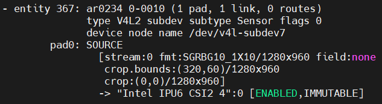

## Description

This document details the configuration settings for the AR0234 MIPI CSI-2 sensor, providing essential information for system integration. The table below presents the key parameters and their respective values used during system setup and validation.

## Table of Contents

- [ACPI Setup - BIOS Configuration](#acpi-setup---bios-configuration)
  - [Sensor ACPI HID](#sensor-acpi-hid)
  - [BIOS Settings for IPU6EPMTL](#bios-settings-for-ipu6epmtl)
  - [BIOS Settings for IPU75XA](#bios-settings-for-ipu75xa)
  - [BIOS Settings for IPU8](#bios-settings-for-ipu8)
- [Libcamhal Configuration File Setup (BIOS Configured Systems)](#libcamhal-configuration-file-setup-bios-configured-systems)
  - [Libcamhal Config for IPU6EPMTL](#libcamhal-config-for-ipu6epmtl)
  - [Libcamhal Config for IPU75XA](#libcamhal-config-for-ipu75xa)
  - [Libcamhal Config for IPU8](#libcamhal-config-for-ipu8)
- [Libcamhal Tuning File Setup](#libcamhal-tuning-file-setup)
  - [Libcamhal Tuning for IPU6EPMTL](#libcamhal-tuning-for-ipu6epmtl)
  - [Libcamhal Tuning for IPU75XA](#libcamhal-tuning-for-ipu75xa)
  - [Libcamhal Tuning for IPU8](#libcamhal-tuning-for-ipu8)
- [Sensor Verification](#sensor-verification)
- [Stream Verification](#stream-verification)
  - [Environment Setup](#environment-setup)
  - [Stream with GStreamer icamerasrc](#stream-with-gstreamer-icamerasrc)
    - [Device Name Selection](#device-name-selection)
    - [Frame Buffer Memory Type (IO Mode) Selection](#frame-buffer-memory-type-io-mode-selection)
    - [Sensor Resolution Selection](#sensor-resolution-selection)
    - [Sensor Format Selection](#sensor-format-selection)
    - [Multi-Stream Selection](#multi-stream-selection)
- [Streaming Result](#streaming-result)
  - [Highest Bandwidth Configuration](#highest-bandwidth-configuration)

---
## ACPI Setup - BIOS Configuration

Using the BIOS configuration exercises the [ipu-acpi](../../drivers/media/platform/intel/) and [max9x](../../drivers/media/i2c/max9x/) drivers.

### Sensor ACPI HID

Use the sensor ACPI HID in the **Custom HID** field.

| Vendor          | Sensor ACPI HID |
|-----------------|:---------------:|
| D3 Embedded     | INTC10C0        |

### BIOS Settings for IPU6EPMTL

<details>
<summary>2x AR0234</summary>

> **Note:** No External Clock required.

>**BIOS Camera Option 1 Path:**\
 `Intel Advanced Menu`->`System Agent (SA) Configuration`->`MIPI Camera Configuration` -> `Control Logic 1` -> **Enabled**

 >**BIOS Camera Option 2 Path:**\
 `Intel Advanced Menu`->`System Agent (SA) Configuration`->`MIPI Camera Configuration` -> `Control Logic 2` -> **Enabled**

|                            | Control Logic 1      | Control Logic 2      |
|---                         |---                   | ---                  |
| Control Logic Type         | Discrete             | Discrete             |
| Number of GPIOs            | 1                    | 1                    |
| Group Pad Number           | 23                   | 0                    |
| Group Number               | D_E_F_V              | A_B_H_S              |
| Com Number                 | COM0                 | COM3                 |
| Function                   | RESET                | RESET                |
| Active Value               | 1                    | 1                    |
| Initial Value              | 1                    | 1                    |

>**BIOS Camera Option 1 Path:**\
 `Intel Advanced Menu`->`System Agent (SA) Configuration`->`MIPI Camera Configuration` -> `Camera Option 1` -> **Enabled**

 >**BIOS Camera Option 2 Path:**\
 `Intel Advanced Menu`->`System Agent (SA) Configuration`->`MIPI Camera Configuration` -> `Camera Option 2` -> **Enabled**

|                            | Camera1 Link options | Camera2 Link options |
|---                         |---                   | ---                  |
| Sensor Model               | User Custom          | User Custom          |
| Custom HID                 | INTC10C0             | INTC10C0             |
| Lanes Clock division       | 4 4 2 2              | 4 4 2 2              |
| CRD Version                | CRD-D                | CRD-D                |
| GPIO control               | Control Logic 1      | Control Logic 2      |
| Camera position            | Front                | Back                 |
| Flash Support              | Disabled             | Disabled             |
| Privacy LED                | Driver default       | Driver default       |
| Rotation                   | 0                    | 0                    |
| PPR Value                  | 2                    | 2                    |
| PPR Unit                   | 2                    | 2                    |
| Camera module name         | _                    | _                    |
| MIPI port                  | 0                    | 4                    |
| LaneUsed                   | x2                   | x2                   |
| MCLK                       | 19200000             | 19200000             |
| EEPROM Type                | ROM_NONE             | ROM_NONE             |
| VCM Type                   | VCM_NONE             | VCM_NONE             |
| Number of I2C Components   | 1                    | 1                    |
| I2C Channel                | I2C1                 | I2C0                 |
| Device 0                   |                      |                      |
| I2C Address                | 10                   | 10                   |
| Device Type                | Sensor               | Sensor               |
| Customize Device ID List   |                      |                      |
| Customize Device ID Number | 17                   | 17                   |
| Customize Device ID Number | 18                   | 18                   |
| Customize Device ID Number | 19                   | 19                   |
| Flash Driver Selection     | Disabled             | Disabled             |

</details>

### BIOS Settings for IPU75XA

<details>
<summary>2x AR0234</summary>

> **Note:** No External Clock required.

>**BIOS Camera Option 1 Path:**\
 `Intel Advanced Menu`->`System Agent (SA) Configuration`->`MIPI Camera Configuration` -> `Control Logic 1` -> **Enabled**

 >**BIOS Camera Option 2 Path:**\
 `Intel Advanced Menu`->`System Agent (SA) Configuration`->`MIPI Camera Configuration` -> `Control Logic 2` -> **Enabled**

|                            | Control Logic 1      | Control Logic 2      |
|---                         |---                   |---                   |
| Control Logic Type         | Discrete             | Discrete             |
| CRD Version                | CRD-D                | CRD-D                |
| Input Clock                | 19.2MHz              | 19.2MHz              |
| PCH Clock                  | IMGCLKOUT_0          | IMGCLKOUT_1          |
| Number of GPIOs            | 1                    | 1                    |
| GPIO Pin 0                 |                      |                      |
| Group Pad Number           | 10                   | 1                    |
| Group Number               | C_E_V                | C_E_V                |
| Com Number                 | COM1                 | COM1                 |
| Function                   | RESET                | RESET                |
| Active Value               | 1                    | 1                    |
| Initial Value              | 0                    | 0                    |
| Interrupt GPIO             | Disabled             | Disabled             |

>**BIOS Camera Option 1 Path:**\
 `Intel Advanced Menu`->`System Agent (SA) Configuration`->`MIPI Camera Configuration` -> `Camera Option 1` -> **Enabled**

 >**BIOS Camera Option 2 Path:**\
 `Intel Advanced Menu`->`System Agent (SA) Configuration`->`MIPI Camera Configuration` -> `Camera Option 2` -> **Enabled**

|                            | Camera1 Link options | Camera2 Link options |
|---                         |---                   | ---                  |
| Sensor Model               | User Custom          | User Custom          |
| Custom HID                 | INTC10C0             | INTC10C0             |
| Lanes Clock division       | 4 4 2 2              | 4 4 2 2              |
| CRD Version                | CRD-D                | CRD-D                |
| GPIO control               | Control Logic 1      | Control Logic 2      |
| Camera position            | Front                | Back                 |
| Flash Support              | Disabled             | Disabled             |
| Privacy LED                | Driver default       | Driver default       |
| Rotation                   | 0                    | 0                    |
| PPR Value                  | 2                    | 2                    |
| PPR Unit                   | 2                    | 2                    |
| PhyConfiguration           | DPHY                 | DPHY                 |
| Camera module name         | _                    | _                    |
| MIPI port                  | 0                    | 2                    |
| LaneUsed                   | x2                   | x2                   |
| MCLK                       | 19200000             | 19200000             |
| EEPROM Type                | ROM_NONE             | ROM_NONE             |
| VCM Type                   | VCM_NONE             | VCM_NONE             |
| Number of I2C Components   | 1                    | 1                    |
| I2C Channel                | I2C1                 | I2C2                 |
| Device 0                   |                      |                      |
| I2C Address                | 10                   | 10                   |
| Device Type                | Sensor               | Sensor               |
| Customize Device ID List   |                      |                      |
| Customize Device ID Number | 17                   | 17                   |
| Customize Device ID Number | 18                   | 18                   |
| Customize Device ID Number | 19                   | 19                   |
| Flash Driver Selection     | Disabled             | Disabled             |

</details>

### BIOS Settings for IPU8

<details>
<summary>2x AR0234</summary>

> **Note:** No External Clock required.

>**BIOS Camera Option 1 Path:**\
 `Intel Advanced Menu`->`System Agent (SA) Configuration`->`MIPI Camera Configuration` -> `Control Logic 1` -> **Enabled**

 >**BIOS Camera Option 2 Path:**\
 `Intel Advanced Menu`->`System Agent (SA) Configuration`->`MIPI Camera Configuration` -> `Control Logic 2` -> **Enabled**

|                            | Control Logic 1      | Control Logic 2      |
|---                         |---                   |---                   |
| Control Logic Type         | Discrete             | Discrete             |
| CRD Version                | CRD-D                | CRD-D                |
| Input Clock                | 19.2MHz              | 19.2MHz              |
| PCH Clock                  | IMGCLKOUT_0          | IMGCLKOUT_1          |
| Number of GPIOs            | 1                    | 1                    |
| GPIO Pin 0                 |                      |                      |
| Group Pad Number           | 10                   | 1                    |
| Group Number               | C_E_V                | C_E_V                |
| Com Number                 | COM1                 | COM1                 |
| Function                   | RESET                | RESET                |
| Active Value               | 1                    | 1                    |
| Initial Value              | 0                    | 0                    |
| Interrupt GPIO             | Disabled             | Disabled             |

>**BIOS Camera Option 1 Path:**\
 `Intel Advanced Menu`->`System Agent (SA) Configuration`->`MIPI Camera Configuration` -> `Camera Option 1` -> **Enabled**

 >**BIOS Camera Option 2 Path:**\
 `Intel Advanced Menu`->`System Agent (SA) Configuration`->`MIPI Camera Configuration` -> `Camera Option 2` -> **Enabled**

|                            | Camera1 Link options | Camera2 Link options |
|---                         |---                   | ---                  |
| Sensor Model               | User Custom          | User Custom          |
| Custom HID                 | INTC10C0             | INTC10C0             |
| Lanes Clock division       | 4 4 2 2              | 4 4 2 2              |
| CRD Version                | CRD-D                | CRD-D                |
| GPIO control               | Control Logic 1      | Control Logic 2      |
| Camera position            | Front                | Back                 |
| Flash Support              | Disabled             | Disabled             |
| Privacy LED                | Driver default       | Driver default       |
| Rotation                   | 0                    | 0                    |
| PPR Value                  | 2                    | 2                    |
| PPR Unit                   | 2                    | 2                    |
| PhyConfiguration           | DPHY                 | DPHY                 |
| Camera module name         | _                    | _                    |
| MIPI port                  | 0                    | 2                    |
| LaneUsed                   | x2                   | x2                   |
| MCLK                       | 19200000             | 19200000             |
| EEPROM Type                | ROM_NONE             | ROM_NONE             |
| VCM Type                   | VCM_NONE             | VCM_NONE             |
| Number of I2C Components   | 1                    | 1                    |
| I2C Channel                | I2C1                 | I2C0                 |
| Device 0                   |                      |                      |
| I2C Address                | 10                   | 10                   |
| Device Type                | Sensor               | Sensor               |
| Customize Device ID List   |                      |                      |
| Customize Device ID Number | 17                   | 17                   |
| Customize Device ID Number | 18                   | 18                   |
| Customize Device ID Number | 19                   | 19                   |
| Flash Driver Selection     | Disabled             | Disabled             |

</details>

---
## Libcamhal Configuration File Setup (BIOS Configured Systems)

#### Libcamhal Config for IPU6EPMTL

<details>
<summary>2x MIPI sensors use case </summary>

Please use recommended config from [ipu6epmtl](../../config/ar0234/ipu6epmtl).

    sudo cp -r ../../config/ar0234/ipu6epmtl /etc/camera
    sudo sed -i '/availableSensors/c\        <availableSensors value="ar0234-a-0,ar0234-b-4"/>' /etc/camera/ipu6epmtl/libcamhal_profile.xml

</details>

#### Libcamhal Config for IPU75XA

<details>
<summary>2x MIPI sensors use case </summary>

Please use recommended config from [ipu75xa](../../config/ar0234/ipu75xa).

    sudo cp -r ../../config/ar0234/ipu75xa /etc/camera

</details>

#### Libcamhal Config for IPU8

<details>
<summary>2x MIPI sensors use case </summary>

Please use recommended config from [ipu8](../../config/ar0234/ipu8).

    sudo cp -r ../../config/ar0234/ipu8 /etc/camera

</details>

---
## Libcamhal Tuning File Setup

RAW sensor required respective tuning configuration files below for streaming:

1. Arithmetic Image Quality Binary (AIQB)
2. Graph Setting Configuration (GCSS)

#### Libcamhal Tuning for IPU6EPMTL

1. Download [AR0234_TGL_10bits.aiqb](https://github.com/intel/ipu6-camera-hal/blob/iotg_ipu6/config/linux/ipu6epmtl/AR0234_TGL_10bits.aiqb)
2. Download [graph_settings_ar0234.xml](https://github.com/intel/ipu6-camera-hal/blob/iotg_ipu6/config/linux/ipu6epmtl/gcss/graph_settings_ar0234.xml)
3. Copy the files into target system:

    ```
    sudo cp AR0234_TGL_10bits.aiqb /etc/camera/ipu6epmtl
    sudo cp graph_settings_ar0234.xml /etc/camera/ipu6epmtl/gcss
    ```

#### Libcamhal Tuning for IPU75XA

The tuning files are available in [ipu75xa](../../config/ar0234/ipu75xa). In the future, this will be hosted at [here](https://github.com/intel/ipu7-camera-hal/tree/main/config/linux/ipu75xa).

#### Libcamhal Tuning for IPU8

The tuning files are available in [ipu8](../../config/ar0234/ipu8). In the future, this will be hosted at [here](https://github.com/intel/ipu7-camera-hal/tree/main/config/linux/ipu8).

---
## Sensor Verification

After completing the setup, verify that the sensor is probed and registered with the V4L2 framework:

    media-ctl -p

When using the BIOS configuration, the output for a single camera should look like the example below.



---
## Stream Verification

Follow the sections below to verify streaming:

- [Environment Setup](#environment-setup)
- [Stream with GStreamer icamerasrc](#stream-with-gstreamer-icamerasrc)

### Environment Setup

Export the environment variables below:

    unset XDG_RUNTIME_DIR
    export DISPLAY=:0; xhost +
    export GST_PLUGIN_PATH=/usr/lib/gstreamer-1.0
    export LIBVA_DRIVER_NAME=iHD
    export GST_GL_API=gles2
    export GST_GL_PLATFORM=egl
    export LIBVA_DRIVERS_PATH=/usr/lib/x86_64-linux-gnu/dri
    export PKG_CONFIG_PATH=/usr/local/lib/pkgconfig:/usr/lib64/pkgconfig:/usr/lib/pkgconfig
    export LD_LIBRARY_PATH=/usr/local/lib/pkgconfig:/usr/local/lib:/usr/lib64:/usr/lib:/usr/lib/x86_64-linux-gnu
    export logSink=terminal
    rm -rf ~/.cache/gstreamer-1.0

For IPU6 only, configure the `isys_freq` value:

    sudo bash -c 'echo "options intel-ipu6 isys_freq_override=475" >> /etc/modprobe.d/ipu.conf'

### Stream with GStreamer icamerasrc

> **Note:** PSYS library requires superuser access, please login as root to run the sample commands given below.

#### Device Name Selection

| MIPI Port | Supported Device-name | Command Pipeline |
|---|---|---|
| CRD1 | ar0234-a | gst-launch-1.0 icamerasrc num-buffers=-1 scene-mode=normal device-name=ar0234-a printfps=true io-mode=dma_mode ! 'video/x-raw(memory:DMABuf),drm-format=NV12,width=1280,height=960' ! glimagesink sync=false |
| CRD2 | ar0234-b | gst-launch-1.0 icamerasrc num-buffers=-1 scene-mode=normal device-name=ar0234-b printfps=true io-mode=dma_mode ! 'video/x-raw(memory:DMABuf),drm-format=NV12,width=1280,height=960' ! glimagesink sync=false |

> **Note**: Refer to icamerasrc device-name property for more sensor details.

#### Frame Buffer Memory Type (IO Mode) Selection

| IO Mode | Command Pipeline |
|---|---|
| USERPTR | gst-launch-1.0 icamerasrc num-buffers=-1 scene-mode=normal device-name=ar0234-a printfps=true io-mode=userptr ! 'video/x-raw,format=NV12,width=1280,height=960' ! glimagesink sync=false |
| DMA MODE | gst-launch-1.0 icamerasrc num-buffers=-1 scene-mode=normal device-name=ar0234-a printfps=true io-mode=dma_mode ! 'video/x-raw(memory:DMABuf),drm-format=NV12,width=1280,height=960' ! glimagesink sync=false |

> **Note**: Refer to icamerasrc io-mode property for more sensor details.

#### Sensor Resolution Selection

| Resolution | Command Pipeline |
|---|---|
| 1280x960 | gst-launch-1.0 icamerasrc num-buffers=-1 scene-mode=normal device-name=ar0234-a printfps=true io-mode=dma_mode ! 'video/x-raw(memory:DMABuf),drm-format=NV12,width=1280,height=960' ! glimagesink sync=false |

#### Sensor Format Selection

| Format | Command Pipeline |
|---|---|
| NV12 | gst-launch-1.0 icamerasrc num-buffers=-1 scene-mode=normal device-name=ar0234-a printfps=true io-mode=dma_mode ! 'video/x-raw(memory:DMABuf),drm-format=NV12,width=1280,height=960' ! glimagesink sync=false |

#### Multi-Stream Selection

| Number of Streams | Command Pipeline |
|---|---|
| x1 | gst-launch-1.0 icamerasrc num-buffers=-1 scene-mode=normal device-name=ar0234-a printfps=true io-mode=dma_mode ! 'video/x-raw(memory:DMABuf),drm-format=NV12,width=1280,height=960' ! glimagesink sync=false |
| x2 | gst-launch-1.0 icamerasrc num-buffers=-1 scene-mode=normal device-name=ar0234-a printfps=true io-mode=dma_mode ! 'video/x-raw(memory:DMABuf),drm-format=NV12,width=1280,height=960' ! glimagesink sync=false icamerasrc num-buffers=-1 scene-mode=normal device-name=ar0234-b printfps=true io-mode=dma_mode ! 'video/x-raw(memory:DMABuf),drm-format=NV12,width=1280,height=960' ! glimagesink sync=false |

---
## Streaming Result

| Number of Streams | IO Mode  | FPS Result |ipu6ep|ipu6epmtl|ipu75xa|ipu8|
|:----------------:|:--------:|:----------:|:----:|:-------:|:-----:|:--:|
| x1               | USERPTR  | 30         |❌|✅|✅|✅|
| x2               | USERPTR  | 30         |❌|✅|✅|✅|
| x1               | DMA MODE | 30         |❌|✅|✅|✅|
| x2               | DMA MODE | 30         |❌|✅|✅|✅|

### Highest Bandwidth Configuration

The highest-bandwidth configurations tested are listed below.

  1. CPHY 2-lane per MIPI Port
     - 2x 1280x960 @ 30fps (default)

---
[↑ Back to Top](#description)
