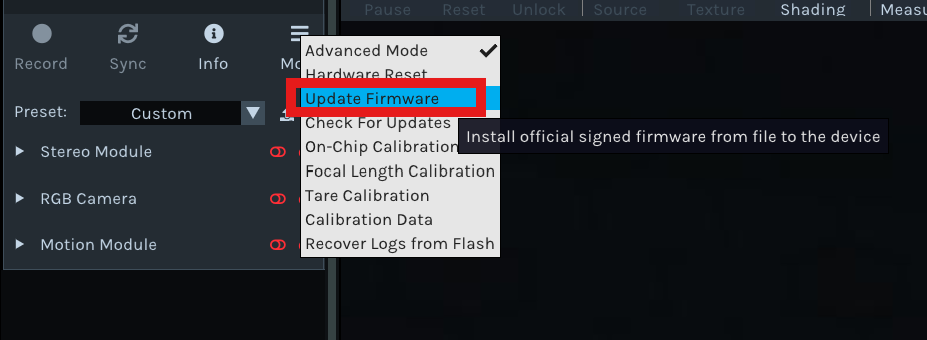

## Description

This document provides the steps to update the firmware (FW) of the D400 series camera using realsense-viewer or rs-fw-update.

> **Note:** The steps below were verified with FW v5.17.3.10. The same procedure applies to other FW versions. Replace the version number and binary file name with the FW version you intend to install.

## Table of Contents

- [Download Firmware](#download-firmware)
- [Prerequisites](#prerequisites)
- [Firmware Upgrade Procedure](#firmware-upgrade-procedure)
- [Option 1: Upgrade by realsense-viewer](#option-1-upgrade-by-realsense-viewer)
- [Option 2: Upgrade by rs-fw-update](#option-2-upgrade-by-rs-fw-update)

## Download Firmware

Download the desired FW version from [Firmware releases D400 - RealSense](https://dev.realsenseai.com/docs/firmware-releases-d400/).

The FW binary file follows the naming convention `Signed_Image_UVC_<version>.bin` (for example, `Signed_Image_UVC_5_17_3_10.bin` for FW v5.17.3.10).

## Prerequisites
Before updating firmware, make sure the following steps are completed:

1. [Pipeline Configuration](./userspace-gmsl.md#advanced-pipeline-configuration---per-stream-configuration)
2. [Symlink Creation](./userspace-gmsl.md#create-symlinks-using-upstream-rs-enumsh)
3. [librealsense SDK compilation](./userspace-gmsl.md#compile-librealsense-sdk-from-source)


## Firmware Upgrade Procedure

Two options are available to upgrade the firmware.

### Option 1: Upgrade by realsense-viewer

1. Click **More -> Update Firmware** in realsense-viewer.
2. Select the FW binary file of the desired FW version.
3. Restart realsense-viewer after the upgrade completes.



### Option 2: Upgrade by rs-fw-update

1. List connected devices to get the camera serial number:

    ```bash
    rs-fw-update -l
    ```

    Example output:

    ```bash
    Connected devices:
    1) [GMSL] RealSense D457 s/n 261122300942, update serial number: 224543110084, firmware version: 5.15.1.55
    ```

    Use the value next to `s/n` as the serial number for `-s`.
2. Run the firmware update:

    ```bash
    rs-fw-update -f FW_BINARY_FILE -s SERIAL_NUMBER
    ```

    Example to update to FW v5.17.3.10:

    ```bash
    rs-fw-update -f Signed_Image_UVC_5_17_3_10.bin -s 261122300942
    ```

Sample output:

```bash
$ sudo ./rs-fw-update -f  Signed_Image_UVC_5_17_3_10.bin -s 261122300942
 09/07 18:55:34,714 WARNING [135123028492160] (context.cpp:41) No valid configuration file found at : /root/.realsense-config.json loading defaults

Search for device with serial number: 261122300942

Updating device FW:
[GMSL] RealSense D401 s/n 261122300942, update serial number: 224543110084, firmware version: 5.15.1.55

Firmware update started. Please don't disconnect device!

Firmware update progress: 100[%]

Firmware update done

Waiting for device to reconnect...

Device 261122300942 successfully updated to FW: 5.17.3.10
```
