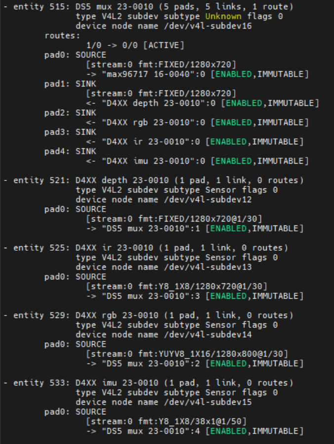

## Description

This document provides details of the configuration settings for the D457 GMSL sensor using maxim-serdes driver.

## Compile ACPI ASL file based on use case

### SSDT for 4x D457 on MAX96724 for IPU75XA

>**Note:** for 4x D457 3D sensor use case

    ../../script/gen_ssdt.sh ../../acpi/ipu7/max96724_rs_d457_gmsl.asl
    sudo update-grub
    sudo reboot

## Configure pipeline

>**Note:** for Depth and RGB streams only on all available links

    ../../script/acpi/mc-setup.sh

>**Note:** for all streams on single link

    ../../script/acpi/mc-setup.sh des=0,link=0,stream=depth,rgb,ir,imu

>**Note:** for Depth and RGB streams only on single link

    ../../script/acpi/mc-setup.sh des=0,link=0,stream=depth,rgb

>**Note:** for 4x RGB stream from all 4 links

    ../../script/acpi/mc-setup.sh des=0,link=0,stream=rgb des=0,link=1,stream=rgb des=0,link=2,stream=rgb des=0,link=3,stream=rgb

## Create symlinks for video devices

>**Note:** This step is only necessary to stream with RealSense SDK. If you are using v4l2src or v4l2-ctl, you can skip this step and use the video device directly.

    sudo ../../script/d4xx/upstream-rs-enum.sh

## Camera Configuration File Setup

#### Setup for IPU75XA

Replace target system with recommended [ipu75xa](../../config/d4xx/ipu75xa) setting

> **Note:** Add config below only

    sudo cp -r ../../config/d4xx/ipu75xa /etc/camera

## Environment Setup

Export environment variables below

    unset XDG_RUNTIME_DIR
    export DISPLAY=:0; xhost +
    export GST_PLUGIN_PATH=/usr/lib/gstreamer-1.0
    export LIBVA_DRIVER_NAME=iHD
    export GST_GL_API=gles2
    export GST_GL_PLATFORM=egl
    export LIBVA_DRIVERS_PATH=/usr/lib/x86_64-linux-gnu/dri
    export PKG_CONFIG_PATH=/usr/local/lib/pkgconfig:/usr/lib64/pkgconfig:/usr/lib/pkgconfig
    export LD_LIBRARY_PATH=/usr/local/lib/pkgconfig:/usr/local/lib:/usr/lib64:/usr/lib:/usr/lib/x86_64-linux-gnu
    export logSink=terminal
    rm -rf ~/.cache/gstreamer-1.0

## Sensor Verification

Upon setup completion, verify sensor with:

    media-ctl -p

### Known Issue

>**1.** All RGB stream can only stream once if there are no Depth stream configured. 
> To stream RGB stream again, you need to reconfigure pipeline using ../../script/acpi/mc-setup.sh with Depth stream enabled, then you need to start & stop
> Depth stream first before any stream can work properly.

### Verify stream using icamerasrc

> **Note:** Have dependency on ipu7-camera-hal PR [#44](https://github.com/intel/ipu7-camera-hal/pull/44) and must configure pipeline using ../../script/acpi/mc-setup.sh before streaming.

#### Sample Userspace Command for icamerasrc

##### Sensor Device Selection

| Sensor Number | Command Pipeline |
|---|---|
| 1 | gst-launch-1.0 icamerasrc num-buffers=-1 num-vc=1 device-name=d4xx-1 printfps=true io-mode=dma_mode ! 'video/x-raw(memory:DMABuf),drm-format=YUYV,width=640,height=480' ! glimagesink sync=false |

> **Note**: Refer to icamerasrc device-name property for more sensor details.

###### How to relate Sensor Number with AIC Link Port

| AIC Link Port | Sensor Number |
|---            |---            |
| A             | 1             |
| B             | 2             |
| C             | 3             |
| D             | 4             |

For AIC MAX96724

##### Frame Buffer Memory Type (IO Mode) Selection

| IO Mode | Command Pipeline |
|---|---|
| MMAP | gst-launch-1.0 icamerasrc num-buffers=-1 num-vc=1 device-name=d4xx-1 printfps=true io-mode=mmap ! 'video/x-raw,format=YUY2,width=640,height=480' ! glimagesink sync=false |
| DMABUF | gst-launch-1.0 icamerasrc num-buffers=-1 num-vc=1 device-name=d4xx-1 printfps=true io-mode=dma_mode ! 'video/x-raw(memory:DMABuf),drm-format=YUYV,width=640,height=480' ! glimagesink sync=false |

> **Note**: Refer to icamerasrc io-mode property for more sensor details.

##### Sensor Resolution Selection

| Resolution | Command Pipeline |
|---|---|
| 640x480 | gst-launch-1.0 icamerasrc num-buffers=-1 num-vc=1 device-name=d4xx-1 printfps=true io-mode=dma_mode ! 'video/x-raw(memory:DMABuf),drm-format=YUYV,width=640,height=480' ! glimagesink sync=false |

##### Sensor Format Selection

| Format | Command Pipeline |
|---|---|
| YUYV | gst-launch-1.0 icamerasrc num-buffers=-1 num-vc=1 device-name=d4xx-1 printfps=true io-mode=dma_mode ! 'video/x-raw(memory:DMABuf),drm-format=YUYV,width=640,height=480' ! glimagesink sync=false |

#### Number of Stream (Single Stream / Multi Stream) Selection

| Number of Stream | Command Pipeline |
|---|---|
| x1 | gst-launch-1.0 icamerasrc num-buffers=-1 num-vc=1 device-name=d4xx-1 printfps=true io-mode=dma_mode ! 'video/x-raw(memory:DMABuf),drm-format=YUYV,width=640,height=480' ! glimagesink sync=false |
| x2 | gst-launch-1.0 icamerasrc num-buffers=-1 num-vc=2 device-name=d4xx-1 printfps=true io-mode=dma_mode ! 'video/x-raw(memory:DMABuf),drm-format=YUYV,width=640,height=480' ! glimagesink sync=false icamerasrc num-buffers=-1 num-vc=2 device-name=d4xx-2 printfps=true io-mode=dma_mode ! 'video/x-raw(memory:DMABuf),drm-format=YUYV,width=640,height=480' ! glimagesink sync=false |
| x4 | gst-launch-1.0 icamerasrc num-buffers=-1 num-vc=4 device-name=d4xx-1 printfps=true io-mode=dma_mode ! 'video/x-raw(memory:DMABuf),drm-format=YUYV,width=640,height=480' ! glimagesink sync=false icamerasrc num-buffers=-1 num-vc=4 device-name=d4xx-2 printfps=true io-mode=dma_mode ! 'video/x-raw(memory:DMABuf),drm-format=YUYV,width=640,height=480' ! glimagesink sync=false icamerasrc num-buffers=-1 num-vc=4 device-name=d4xx-3 printfps=true io-mode=dma_mode ! 'video/x-raw(memory:DMABuf),drm-format=YUYV,width=640,height=480' ! glimagesink sync=false icamerasrc num-buffers=-1 num-vc=4 device-name=d4xx-4 printfps=true io-mode=dma_mode ! 'video/x-raw(memory:DMABuf),drm-format=YUYV,width=640,height=480' ! glimagesink sync=false |

### Verify stream using v4l2src

#### Sample Userspace Command for v4l2src

> **Note:** Get device and RGB stream from output of mc-mixed.sh

    gst-launch-1.0 v4l2src device=/dev/video4 ! 'video/x-raw,format=YUY2,width=640,height=480,framerate=30/1,pixel-aspect-ratio=1/1' ! glimagesink

If already created symlinks for video devices, you may also use the symlinked video device for streaming. For example:

    gst-launch-1.0 v4l2src device=/dev/video-rs-color-0 ! 'video/x-raw,format=YUY2,width=640,height=480,framerate=30/1,pixel-aspect-ratio=1/1' ! glimagesink

### Verify stream using v4l2-ctl

>**Note:** v4l2-ctl does not have output on monitor, only printout in terminal.

Modify video device according to output of ../../script/acpi/mc-mixed.sh

    v4l2-ctl -d /dev/video0 --stream-mmap 

>**Note:** If already created symlinks for video devices using ../../script/d4xx/upstream-rs-enum.sh, you may also use the symlinked video device for streaming. For example:

    v4l2-ctl -d /dev/video-rs-depth-0 --stream-mmap
    v4l2-ctl -d /dev/video-rs-color-0 --stream-mmap

### Verify stream using RealSense SDK

>**Note:** This step has dependency on librealsense PR [#15007](https://github.com/IntelRealSense/librealsense/pull/15007) and must configure pipeline using ../../script/acpi/mc-mixed.sh before streaming, and also requires symlinks for video devices created using ../../script/d4xx/upstream-rs-enum.sh.

Clone librealsense repo

    git clone https://github.com/realsenseai/librealsense.git
    cd librealsense
    git fetch origin pull/15007/head:pr-15007
    git checkout pr-15007
    mkdir build && cd build
    cmake .. -DCMAKE_BUILD_TYPE=Release -DCMAKE_INSTALL_PREFIX=/usr/local
    make -j2
    cd Release

Verify stream using rs-depth

>**Note:** rs-depth will show output in terminal

    ./rs-depth

Verify stream using rs-color

>**Note:** rs-color will show output in terminal

    ./rs-color

Verify stream using rs-multicam

>**Note:** rs-multicam will show output in graphical interface

    ./rs-multicam

Verify stream using realsense-viewer

>**Note:** realsense-viewer will show output in a graphical interface and require user to manually select the streams on the GUI.

    ./realsense-viewer
