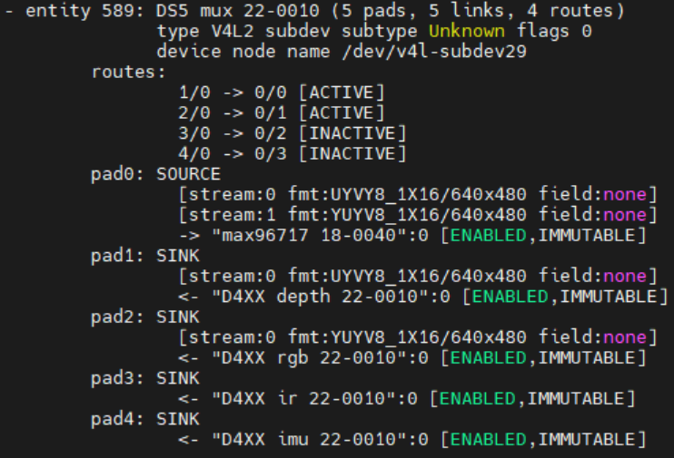

## Description

This document provides details of the configuration settings for the D457 GMSL sensor using maxim-serdes driver.

## Compile ACPI ASL file based on use case

### SSDT for 2x + 2x D457 on MAX96724 for IPU75XA

Currently we only provide SSDT for 2x + 2x D457 use case on MAX96724 for IPU75XA. If you want to have different connection, please modify the SSDT before compiling.

>**Note:** MAX96724 only have 4 pipes, and for now only legacy mode is supported, which means only 4 streams can be streamed at the same time per deserializer. This is why we only provide SSDT for 2x on each DES use case.

>**Note:** for 2x + 2x D457 3D sensor use case

    ../../script/gen_ssdt.sh ../../acpi/ipu7/max96724_rs_d457.asl
    sudo update-grub
    sudo reboot

## Configure pipeline using mc-setup.sh for D4XX GMSL 3D sensor

Please refer to [Configure pipeline for 3D sensors](../acpi/userspace-gmsl.md#construct-pipeline-for-3d-sensors).

>**Note:** MAX96724 only support 4 active routing (matching with 4 internal pipes) at the same time, so maximum only 4 streams can be enabled on each DES, and by default it is 2 streams (Depth+RGB) from each D457 (assuming 2x D457 connected on each DES).

After configuring the pipeline, it is recommended to run sanity streaming test using v4l2-ctl on each nodes. Please refer to [Sanity Streaming Test using v4l2-ctl](./userspace-gmsl.md#sanity-streaming-test-using-v4l2-ctl) for more details.

## Create symlinks using upstream-rs-enum.sh for RealSense SDK

>**Note:** This step is only necessary to stream with RealSense SDK. If you are using v4l2src or v4l2-ctl, you can skip this step and use the video device directly.

By running the script below, it creates symlinks for video devices that will be used for streaming with RealSense SDK. Symlink that is created will need to be used with librealsense PR [#15007](https://github.com/IntelRealSense/librealsense/pull/15007).

    sudo ../../script/d4xx/upstream-rs-enum.sh

### Sample Video Node Symlink

The symlink for capture node should be the same as the output of mc-setup.sh command. The syntax looks like video-rs-{stream-type}-{index}, and the stream type can be depth, color, ir or imu. The index starts from 0 for link 0 on DES0, then incremented by 1 for link 1, link 2 and link 3. 

For example, if Depth and RGB stream from Link 0 on DES0 are enabled, the symlink for Depth stream will be video-rs-depth-0 and the symlink for RGB stream will be video-rs-color-0, and both of them will point to the corresponding video node allocated by kernel.

| Sample Capture Node | Sample symlink |
|---|---|
| Intel IPU7 ISYS Capture 0 | video-rs-depth-0 -> /dev/video0 |
| Intel IPU7 ISYS Capture 1 | video-rs-color-0 -> /dev/video4 |

### Sample Subdev Symlink

The subdev symlink is created with syntax video-rs-{stream-type}-sd-{index}, and the stream type and index follow the same rule as capture node symlink, except that it is pointing to the subdev node instead of video capture node. The subdev node is used for configuration of the sensor, and it is required to be used with librealsense PR [#15007](https://github.com/IntelRealSense/librealsense/pull/15007).

| Sample Entity | Sample symlink |
|---|---|
| D4XX depth 19-0010 | /dev/video-rs-depth-sd-0 -> /dev/v4l-subdev10 |
| D4XX ir 19-0010 | /dev/video-rs-ir-sd-0 -> /dev/v4l-subdev11 |
| D4XX rgb 19-0010 | /dev/video-rs-color-sd-0 -> /dev/v4l-subdev12 |
| D4XX imu 19-0010 | /dev/video-rs-imu-sd-0 -> /dev/v4l-subdev13 |

## Sensor Verification

Each of the entity should have their own subdev node. If there is mismatch in the ASL and actual hardware connection (hardware is less, or probe failed), all of the sensor subdev node will not be created and mc-setup script will fail to execute.

Upon Bootup, run `media-ctl -p` command should show 

Upon running mc-setup script, `media-ctl -p` command should show

### Known Issue

>**1.** All RGB stream can only stream once if there are no Depth stream configured.
> To stream RGB stream again, you need to reconfigure pipeline using ../../script/acpi/mc-setup.sh with Depth stream enabled, then you need to start & stop Depth stream first before any stream can work properly.

## Sensor stream verification

### Sanity Streaming Test using v4l2-ctl

>Pro: v4l2-ctl can directly be used once mc-setup is completed without any libcamhal configuration files setup, even leaner than v4l2src since it does not need gstreamer.

>Con: no preview window, only show streaming status in terminal.

After running mc-setup, Run basic sanity tests using v4l2-ctl to make sure all streams are working properly. For example, if Depth and RGB stream from Link 0 on DES0 are enabled, run command below should show streaming in terminal without error.

    v4l2-ctl -d /dev/video0 --stream-mmap
    v4l2-ctl -d /dev/video4 --stream-mmap

### Gstreamer streaming using v4l2src

>Pro: v4l2src can directly be used once mc-setup is completed without any libcamhal configuration files setup.

>Con: v4l2src does not support DMABuf which might hit some performance issue.

#### Sample Command for v4l2src

Note: please use the respective video node that is shown in the output of mc-setup.sh.

| Stream | Link Number | Command Pipeline |
| --- | --- | --- |
| depth | link 0 | gst-launch-1.0 v4l2src device=/dev/video0 ! 'video/x-raw,format=UYVY,width=640,height=480,framerate=30/1,pixel-aspect-ratio=1/1' ! glimagesink |
| depth | link 1 | gst-launch-1.0 v4l2src device=/dev/video1 ! 'video/x-raw,format=UYVY,width=640,height=480,framerate=30/1,pixel-aspect-ratio=1/1' ! glimagesink |
| rgb | link 0 | gst-launch-1.0 v4l2src device=/dev/video4 ! 'video/x-raw,format=YUY2,width=640,height=480,framerate=30/1,pixel-aspect-ratio=1/1' ! glimagesink |
| rgb | link 1 | gst-launch-1.0 v4l2src device=/dev/video5 ! 'video/x-raw,format=YUY2,width=640,height=480,framerate=30/1,pixel-aspect-ratio=1/1' ! glimagesink |

### Gstreamer streaming using icamerasrc

>Pro: icamerasrc support DMABuf which can have better performance.

>Con: Have dependency on [ipu7-camera-hal PR](https://github.com/intel/ipu7-camera-hal/pull/44)

Follow section [Camera Configuration File Setup for IPU75XA](./userspace-gmsl.md#camera-configuration-file-setup-for-ipu75xa) to setup config file for icamerasrc.

Follow section [Environment Setup](./userspace-gmsl.md#environment-setup) to setup environment for icamerasrc.

#### Camera Configuration File Setup for IPU75XA

Replace target system with recommended [ipu75xa](../../config/d4xx/ipu75xa) setting

> **Note:** Add config below only if using 2x + 2x D457 3D sensor use case.

    sudo cp -r ../../config/d4xx/ipu75xa /etc/camera

## Environment Setup

Export environment variables below

    unset XDG_RUNTIME_DIR
    export DISPLAY=:0; xhost +
    export GST_PLUGIN_PATH=/usr/lib/gstreamer-1.0
    export LIBVA_DRIVER_NAME=iHD
    export GST_GL_API=gles2
    export GST_GL_PLATFORM=egl
    export LIBVA_DRIVERS_PATH=/usr/lib/x86_64-linux-gnu/dri
    export PKG_CONFIG_PATH=/usr/local/lib/pkgconfig:/usr/lib64/pkgconfig:/usr/lib/pkgconfig
    export LD_LIBRARY_PATH=/usr/local/lib/pkgconfig:/usr/local/lib:/usr/lib64:/usr/lib:/usr/lib/x86_64-linux-gnu
    export logSink=terminal
    rm -rf ~/.cache/gstreamer-1.0

#### Sample Command for icamerasrc

##### Sensor Device Selection

For 2x + 2x D457 use case, use Link Number 1,2,5,6.

| Link Number | Command Pipeline |
|---|---|
| 1 | gst-launch-1.0 icamerasrc num-buffers=-1 num-vc=1 device-name=d4xx-1 printfps=true io-mode=dma_mode ! 'video/x-raw(memory:DMABuf),drm-format=YUYV,width=640,height=480' ! glimagesink sync=false |
| 2 | gst-launch-1.0 icamerasrc num-buffers=-1 num-vc=1 device-name=d4xx-2 printfps=true io-mode=dma_mode ! 'video/x-raw(memory:DMABuf),drm-format=YUYV,width=640,height=480' ! glimagesink sync=false |
| 3 | gst-launch-1.0 icamerasrc num-buffers=-1 num-vc=1 device-name=d4xx-3 printfps=true io-mode=dma_mode ! 'video/x-raw(memory:DMABuf),drm-format=YUYV,width=640,height=480' ! glimagesink sync=false |
| 4 | gst-launch-1.0 icamerasrc num-buffers=-1 num-vc=1 device-name=d4xx-4 printfps=true io-mode=dma_mode ! 'video/x-raw(memory:DMABuf),drm-format=YUYV,width=640,height=480' ! glimagesink sync=false |
| 5 | gst-launch-1.0 icamerasrc num-buffers=-1 num-vc=1 device-name=d4xx-5 printfps=true io-mode=dma_mode ! 'video/x-raw(memory:DMABuf),drm-format=YUYV,width=640,height=480' ! glimagesink sync=false |
| 6 | gst-launch-1.0 icamerasrc num-buffers=-1 num-vc=1 device-name=d4xx-6 printfps=true io-mode=dma_mode ! 'video/x-raw(memory:DMABuf),drm-format=YUYV,width=640,height=480' ! glimagesink sync=false |
| 7 | gst-launch-1.0 icamerasrc num-buffers=-1 num-vc=1 device-name=d4xx-7 printfps=true io-mode=dma_mode ! 'video/x-raw(memory:DMABuf),drm-format=YUYV,width=640,height=480' ! glimagesink sync=false |
| 8 | gst-launch-1.0 icamerasrc num-buffers=-1 num-vc=1 device-name=d4xx-8 printfps=true io-mode=dma_mode ! 'video/x-raw(memory:DMABuf),drm-format=YUYV,width=640,height=480' ! glimagesink sync=false |

> **Note**: Refer to icamerasrc device-name property for more sensor details.

###### How to relate Sensor Number with AIC Link Port

| AIC Link Port | Sensor Number |
|---            |---            |
| A             | 1             |
| B             | 2             |
| C             | 3             |
| D             | 4             |

For AIC MAX96724

##### Frame Buffer Memory Type (IO Mode) Selection

| Stream | IO Mode | Command Pipeline |
|---|---|---|
| RGB | MMAP | gst-launch-1.0 icamerasrc num-buffers=-1 num-vc=1 device-name=d4xx-1 printfps=true io-mode=mmap ! 'video/x-raw,format=YUY2,width=640,height=480' ! glimagesink sync=false |
| RGB | DMABUF | gst-launch-1.0 icamerasrc num-buffers=-1 num-vc=1 device-name=d4xx-1 printfps=true io-mode=dma_mode ! 'video/x-raw(memory:DMABuf),drm-format=YUYV,width=640,height=480' ! glimagesink sync=false |

> **Note**: Refer to icamerasrc io-mode property for more sensor details.

##### Sensor Resolution Selection

| Stream| Resolution | Command Pipeline |
| --- | --- | --- |
| RGB | 640x480 | gst-launch-1.0 icamerasrc num-buffers=-1 num-vc=1 device-name=d4xx-1 printfps=true io-mode=dma_mode ! 'video/x-raw(memory:DMABuf),drm-format=YUYV,width=640,height=480' ! glimagesink sync=false |

##### Sensor Format Selection

| Stream | Format | Command Pipeline |
| --- | --- | --- |
| RGB | YUYV | gst-launch-1.0 icamerasrc num-buffers=-1 num-vc=1 device-name=d4xx-1 printfps=true io-mode=dma_mode ! 'video/x-raw(memory:DMABuf),drm-format=YUYV,width=640,height=480' ! glimagesink sync=false |

#### Number of Stream (Single Stream / Multi Stream) Selection

| Stream | Number of Stream | Command Pipeline |
| --- | --- | --- |
| RGB | x1 | gst-launch-1.0 icamerasrc num-buffers=-1 num-vc=1 device-name=d4xx-1 printfps=true io-mode=dma_mode ! 'video/x-raw(memory:DMABuf),drm-format=YUYV,width=640,height=480' ! glimagesink sync=false |
| RGB | x2 | gst-launch-1.0 icamerasrc num-buffers=-1 num-vc=2 device-name=d4xx-1 printfps=true io-mode=dma_mode ! 'video/x-raw(memory:DMABuf),drm-format=YUYV,width=640,height=480' ! glimagesink sync=false icamerasrc num-buffers=-1 num-vc=2 device-name=d4xx-2 printfps=true io-mode=dma_mode ! 'video/x-raw(memory:DMABuf),drm-format=YUYV,width=640,height=480' ! glimagesink sync=false |
| RGB | x4 (x2 + x2) | gst-launch-1.0 icamerasrc num-buffers=-1 num-vc=4 device-name=d4xx-1 printfps=true io-mode=dma_mode ! 'video/x-raw(memory:DMABuf),drm-format=YUYV,width=640,height=480' ! glimagesink sync=false icamerasrc num-buffers=-1 num-vc=4 device-name=d4xx-2 printfps=true io-mode=dma_mode ! 'video/x-raw(memory:DMABuf),drm-format=YUYV,width=640,height=480' ! glimagesink sync=false icamerasrc num-buffers=-1 num-vc=4 device-name=d4xx-5 printfps=true io-mode=dma_mode ! 'video/x-raw(memory:DMABuf),drm-format=YUYV,width=640,height=480' ! glimagesink sync=false icamerasrc num-buffers=-1 num-vc=4 device-name=d4xx-6 printfps=true io-mode=dma_mode ! 'video/x-raw(memory:DMABuf),drm-format=YUYV,width=640,height=480' ! glimagesink sync=false |

### Verify stream using RealSense SDK

Dependency

    librealsense PR [#15007](https://github.com/IntelRealSense/librealsense/pull/15007) 

    Requires Pipeline Configuration using ../../script/acpi/mc-setup.sh

    Requires Symlinks Creation using ../../script/d4xx/upstream-rs-enum.sh

Clone librealsense repo

    git clone https://github.com/realsenseai/librealsense.git
    cd librealsense
    git fetch origin pull/15007/head:pr-15007
    git checkout pr-15007
    mkdir build && cd build
    cmake .. -DCMAKE_BUILD_TYPE=Release -DCMAKE_INSTALL_PREFIX=/usr/local
    make -j2
    cd Release

Verify stream using realsense-viewer (output in graphical interface).

>**Note:** realsense-viewer will show output in a graphical interface and require user to manually select the streams on the GUI.

    ./realsense-viewer

Verify multiple streams using rs-multicam (output in graphical interface)

    ./rs-multicam

Verify single Depth Stream using rs-depth (only Terminal output)

    ./rs-depth

Verify single Color Stream using rs-color (only Terminal output)

    ./rs-color

