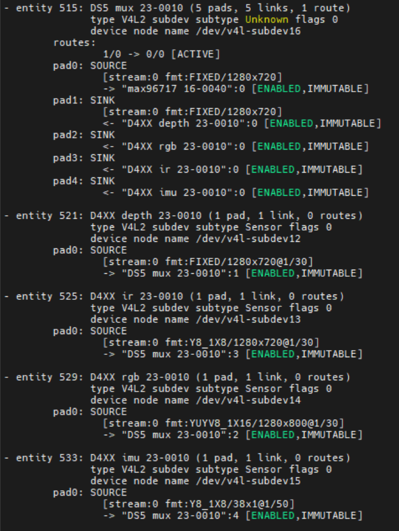
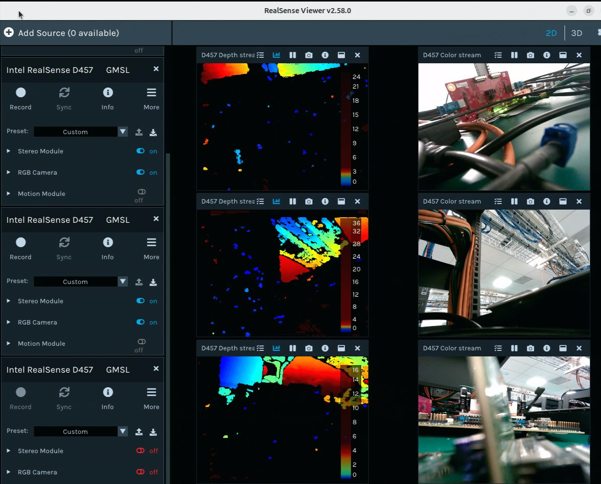
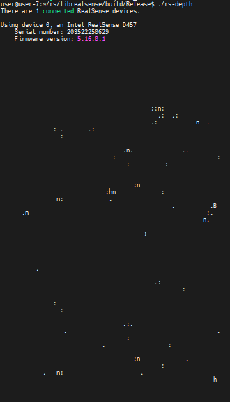
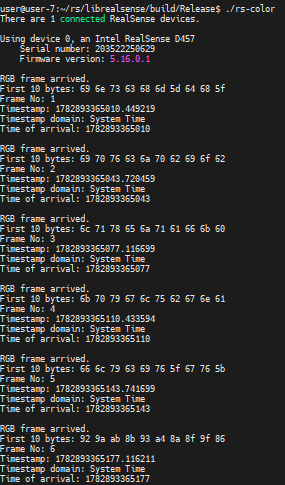

## Description

This document describes the configuration settings for the D457 GMSL sensor using the maxim-serdes driver. Before going through this document, make sure you have completed the prerequisites, fully understand the ASL configurations, and know how to use mc-setup.sh.

> Prerequisites:\
> [acpi/kernelspace.md](../acpi/kernelspace.md) \
> [acpi/userspace-gmsl.md](../acpi/userspace-gmsl.md)

> **If firmware update is required:** refer to [firmware-update.md](./firmware-update.md).
> Firmware update is required to resolve the long-duration test case issue for the D457 and to support the external frame sync feature.

---
## ACPI Setup - ASL Configuration

<h3>IMPORTANT: BIOS setting needs to be turned OFF if using ASL method</h3>

ASL source files provided are for **reference only**.

> **NOTE:** \
> Always make sure ASL configuration matches actual hardware connection.

---
### ASL Configuration for IPU6EPMTL

 MAX9296 DPHY + 4x D457 GMSL sensor use case 

- DES0 (MAX9296)
    - Link 0: D457
    - Link 1: D457
- DES1 (MAX9296)
    - Link 0: D457
    - Link 1: D457

>**ASL:** [max9296_rs_d457.asl](../../acpi/ipu6/max9296_rs_d457.asl)\
For compilation and loading, please refer to [kernelspace.md](../acpi/kernelspace.md#compile-and-load).

(<a href="#advanced-pipeline-configuration---per-stream-configuration">Go to Advanced Pipeline Configuration</a>)

---
### ASL Configuration for IPU75XA

 MAX96724 CPHY + 4x D457 GMSL sensor use case 

- DES0 (MAX96724)
    - Link 0: D457
    - Link 1: D457
- DES1 (MAX96724)
    - Link 0: D457
    - Link 1: D457

>**ASL:** [max96724_rs_d457.asl](../../acpi/ipu7/max96724_rs_d457.asl)\
For compilation and loading, please refer to [kernelspace.md](../acpi/kernelspace.md#compile-and-load).

(<a href="#advanced-pipeline-configuration---per-stream-configuration">Go to Advanced Pipeline Configuration</a>)

---
### ASL Configuration for IPU8

 MAX96724 CPHY + 4x D457 GMSL sensor use case 

- DES0 (MAX96724)
    - Link 0: D457
    - Link 1: D457
- DES1 (MAX96724)
    - Link 0: D457
    - Link 1: D457

>**ASL:** [max96724_rs_d457.asl](../../acpi/ipu8/max96724_rs_d457.asl)\
For compilation and loading, please refer to [kernelspace.md](../acpi/kernelspace.md#compile-and-load).

(<a href="#advanced-pipeline-configuration---per-stream-configuration">Go to Advanced Pipeline Configuration</a>)

---
## Sensor Verification

Each of the entity should have their own subdev node. If there is mismatch in the ASL and actual hardware connection (hardware is less, or probe failed), all of the sensor subdev node will not be created and mc-setup script will fail to execute.

After boot, running `media-ctl -p` should show:

---
## Supported Configuration for Each Stream

| Stream | Format                   | Resolution | FPS |
| ---    | ---                      | ---        | --- |
| Depth  | FIXED* , UYVY8_1X16      | 1280x720   | 30, 15, 5 |
|        |                          | 848x480    | 90, 60, 30, 15, 5 |
|        |                          | 848x100    | 100 |
|        |                          | 640x480*   | 90, 60, 30*, 15, 5 |
|        |                          | 848x360    | 90, 60, 30, 15, 5 |
|        |                          | 480x270    | 90, 60, 30, 15, 5 |
|        |                          | 424x240    | 90, 60, 30, 15, 5 |
|        |                          | 256x144    | 90 |
| RGB    | YUYV8_1X16*              | 1280x800   | 30, 15, 10, 5 |
|        |                          | 1280x720   | 30, 15, 10, 5 |
|        |                          | 848x480    | 60, 30, 15, 5 |
|        |                          | 640x480*   | 60, 30*, 15, 5 |
|        |                          | 640x360    | 90, 60, 30, 15, 5 |
|        |                          | 480x270    | 90, 60, 30, 15, 5 |
|        |                          | 424x240    | 90, 60, 30, 15, 5 |
| IR     | Y8_1X8* , VYUY8_1X16     | 1280x720   | 30, 15, 5 |
|        |                          | 848x480    | 90, 60, 30, 15, 5 |
|        |                          | 640x480*   | 90, 60, 30*, 15, 5 |
|        |                          | 640x360    | 90, 60, 30, 15, 5 |
|        |                          | 480x270    | 90, 60, 30, 15, 5 |
|        |                          | 424x240    | 90, 60, 30, 15, 5 |
|        | RGB888_1X24              | 1280x800   | 30, 15 |
| IMU    | Y8_1X8*                  | 38x1*      | 400, 200, 100, 50* |

>**Note:** The format, resolution, and FPS marked with * are the default configuration for each stream after a power cycle. Reboot keeps the configuration from the previous session.

## Advanced Pipeline Configuration - Per-Stream Configuration

>Prerequisites: \
> Go through [how to use mc-setup.sh](../acpi/userspace-gmsl.md#how-to-use-mc-setupsh) \
> Go through [Advanced Pipeline Configuration](../acpi/userspace-gmsl.md#advanced---per-stream-configuration)

This section will provide more stream combinations other than default streams.
The combinations are based on [IPU7 ASL](#asl-configuration-for-ipu75xa).

<h3> Please modify the commands accordingly to fit your use case.</h3>

 1x Depth Stream 

#### Command for GStreamer streaming

    ../../script/acpi/mc-setup.sh des=0,\
    link=0,stream=[depth,format=UYVY8_1X16,res=1280x720,fps=30]

#### Output

    Configuration summary:
    DES0 LINK0      Sensor model    d4xx
                    Stream          [depth]  1280x720   UYVY8_1X16    30.000 FPS -->  /dev/video0

(<a href="#stream-verification">Go to Sensor Stream Verification</a>)

#### Command for RealSense SDK use

    ../../script/acpi/mc-setup.sh des=0,\
    link=0,stream=[depth,format=FIXED,res=1280x720,fps=30]

#### Output

    Configuration summary:
    DES0 LINK0      Sensor model    d4xx
                    Stream          [depth]  1280x720   UYVY8_1X16      30.000 FPS -->  /dev/video0

> FIXED format is mapped as UYVY8_1X16 in the pipeline, but Video Node is configured as 'Z16 '.

(<a href="#stream-verification">Go to Sensor Stream Verification</a>)

 1x RGB Stream 

#### Command for GStreamer streaming and RealSense SDK use

    ../../script/acpi/mc-setup.sh des=0,\
    link=0,stream=[rgb,format=YUYV8_1X16,res=1280x800,fps=30]

#### Output

    Configuration summary:
    DES0 LINK0      Sensor model    d4xx
                    Stream          [rgb]    1280x800   YUYV8_1X16    30.000 FPS -->  /dev/video4

(<a href="#stream-verification">Go to Sensor Stream Verification</a>)

 1x IR Stream 

#### Command 1 for GStreamer streaming

    ../../script/acpi/mc-setup.sh des=0,\
    link=0,stream=[ir,format=Y8_1X8,res=1280x720,fps=30]

#### Command 2 for GStreamer streaming

    ../../script/acpi/mc-setup.sh des=0,\
    link=0,stream=[ir,format=RGB888_1X24,res=1280x800,fps=30]

#### Output

    # Output for Command 1
    Configuration summary:
    DES0 LINK0      Sensor model    d4xx
                    Stream          [ir]     1280x720   Y8_1X8        30.000 FPS -->  /dev/video6

    # Output for Command 2
    Configuration summary:
    DES0 LINK0      Sensor model    d4xx
                    Stream          [ir]     1280x800   RGB888_1X24   30.000 FPS -->  /dev/video6

(<a href="#stream-verification">Go to Sensor Stream Verification</a>)

#### Command for RealSense SDK streaming

    ../../script/acpi/mc-setup.sh des=0,\
    link=0,stream=[ir,format=VYUY8_1X16,res=1280x720,fps=30]

#### Output

    Configuration summary:
    DES0 LINK0      Sensor model    d4xx
                    Stream          [ir]     1280x720   VYUY8_1X16    30.000 FPS -->  /dev/video6

(<a href="#stream-verification">Go to Sensor Stream Verification</a>)

 1x IMU Stream 

#### Command for GStreamer and RealSense SDK streaming

    ../../script/acpi/mc-setup.sh des=0,\
    link=0,stream=[imu,format=Y8_1X8,res=38x1,fps=400]

#### Output

    Configuration summary:
    DES0 LINK0      Sensor model    d4xx
                    Stream          [imu]    38x1       Y8_1X8       400.000 FPS -->  /dev/video2

(<a href="#stream-verification">Go to Sensor Stream Verification</a>)

 1 D457 with all 4 streams (4 current configuration) 

#### Command for GStreamer

    ../../script/acpi/mc-setup.sh des=0,\
    link=0,stream=[depth],[rgb],[ir],[imu]

    # or

    ../../script/acpi/mc-setup.sh des=0,\
    link=0,stream=depth,rgb,ir,imu

#### Output

    Configuration summary:
    DES0 LINK0      Sensor model    d4xx
                    Stream          [depth]  1280x720   UYVY8_1X16    30.000 FPS -->  /dev/video0
                    Stream          [rgb]    1280x800   YUYV8_1X16    30.000 FPS -->  /dev/video4
                    Stream          [ir]     1280x720   VYUY8_1X16    30.000 FPS -->  /dev/video6
                    Stream          [imu]    38x1       Y8_1X8       400.000 FPS -->  /dev/video2

#### Command for RealSense SDK streaming

    ../../script/acpi/mc-setup.sh des=0,\
    link=0,stream=[depth,format=FIXED],[rgb],[ir],[imu]

#### Output

    Configuration summary:
    DES0 LINK0      Sensor model    d4xx
                    Stream          [depth]  1280x720   UYVY8_1X16    30.000 FPS -->  /dev/video0
                    Stream          [rgb]    1280x800   YUYV8_1X16    30.000 FPS -->  /dev/video4
                    Stream          [ir]     1280x720   VYUY8_1X16    30.000 FPS -->  /dev/video6
                    Stream          [imu]    38x1       Y8_1X8       400.000 FPS -->  /dev/video2

> FIXED format is mapped as UYVY8_1X16 in the pipeline, but Video Node is configured as 'Z16 '.

(<a href="#stream-verification">Go to Sensor Stream Verification</a>)

 1 D457 with all 4 streams (2 current configuration, 2 update configuration) 

#### Command for GStreamer

    ../../script/acpi/mc-setup.sh des=0,\
    link=0,stream=[depth,format=UYVY8_1X16,res=1280x720,fps=30],\
    [rgb],\
    [ir,format=Y8_1X8,res=1280x720,fps=30],\
    [imu]

#### Output

    Configuration summary:
    DES0 LINK0      Sensor model    d4xx
                    Stream          [depth]  1280x720   UYVY8_1X16    30.000 FPS -->  /dev/video0
                    Stream          [rgb]    1280x800   YUYV8_1X16    30.000 FPS -->  /dev/video4
                    Stream          [ir]     1280x720   Y8_1X8        30.000 FPS -->  /dev/video6
                    Stream          [imu]    38x1       Y8_1X8       400.000 FPS -->  /dev/video2

#### Command for RealSense SDK streaming

    ../../script/acpi/mc-setup.sh des=0,\
    link=0,stream=[depth,format=FIXED,res=1280x720,fps=30],\
    [rgb],\
    [ir,format=Y8_1X8,res=1280x720,fps=30],\
    [imu]

#### Output

    Configuration summary:
    DES0 LINK0      Sensor model    d4xx
                    Stream          [depth]  1280x720   UYVY8_1X16    30.000 FPS -->  /dev/video0
                    Stream          [rgb]    1280x800   YUYV8_1X16    30.000 FPS -->  /dev/video4
                    Stream          [ir]     1280x720   Y8_1X8        30.000 FPS -->  /dev/video6
                    Stream          [imu]    38x1       Y8_1X8       400.000 FPS -->  /dev/video2

> FIXED format is mapped as UYVY8_1X16 in the pipeline, but Video Node is configured as 'Z16 '.

(<a href="#stream-verification">Go to Sensor Stream Verification</a>)

 1 D457 with 3 streams (2 current configuration, 1 update configuration) 

#### Command

    ../../script/acpi/mc-setup.sh des=0,\
    link=0,stream=[depth],\
    [rgb,format=YUYV8_1X16,res=1280x800,fps=30],\
    [ir]

#### Output

    Configuration summary:
    DES0 LINK0      Sensor model    d4xx
                    Stream          [depth]  1280x720   UYVY8_1X16    30.000 FPS -->  /dev/video0
                    Stream          [rgb]    1280x800   YUYV8_1X16    30.000 FPS -->  /dev/video4
                    Stream          [ir]     1280x720   Y8_1X8        30.000 FPS -->  /dev/video6

(<a href="#stream-verification">Go to Sensor Stream Verification</a>)

 2 D457 with 2 streams (4 update configuration) 

#### Command

    ../../script/acpi/mc-setup.sh \
    des=0,link=0,stream=[depth,format=UYVY8_1X16,res=1280x720,fps=30],\
    [rgb,format=YUYV8_1X16,res=1280x800,fps=30] \
    des=0,link=1,stream=[depth,format=UYVY8_1X16,res=640x480,fps=90],\
    [rgb,format=YUYV8_1X16,res=424x240,fps=5]

#### Output

    Configuration summary:
    DES0 LINK0      Sensor model    d4xx
                    Stream          [depth]  1280x720   UYVY8_1X16    30.000 FPS -->  /dev/video0
                    Stream          [rgb]    1280x800   YUYV8_1X16    30.000 FPS -->  /dev/video4
    DES0 LINK1      Sensor model    d4xx
                    Stream          [depth]  640x480    UYVY8_1X16    90.000 FPS -->  /dev/video1
                    Stream          [rgb]    424x240    YUYV8_1X16     5.000 FPS -->  /dev/video5

(<a href="#stream-verification">Go to Sensor Stream Verification</a>)

## Stream Verification

Below are the sample Device Node mapping for each stream for 4 D457 on a single Deserializer.

| Link Number | Stream | device |
| --- | --- | --- |
| DES0 Link 0 | depth  | video0 |
| DES0 Link 1 | depth  | video1 |
| DES0 Link 2 | depth  | video2 |
| DES0 Link 3 | depth  | video3 |
| DES0 Link 0 | rgb    | video4 |
| DES0 Link 1 | rgb    | video5 |
| DES0 Link 2 | rgb    | video6 |
| DES0 Link 3 | rgb    | video7 |
| DES0 Link 0 | ir     | video6 |
| DES0 Link 1 | ir     | video7 |
| DES0 Link 2 | ir     | video4 |
| DES0 Link 3 | ir     | video5 |
| DES0 Link 0 | imu    | video2 |
| DES0 Link 1 | imu    | video3 |
| DES0 Link 2 | imu    | video0 |
| DES0 Link 3 | imu    | video1 |

Note that there are conflicting video nodes for IR and RGB streams, and IMU and Depth streams.
The limiting factors that result in this design are:
1. V4L2_FRAME_DESC_ENTRY_MAX is FIXED to 8, so ACTIVE routing is limited to 8 streams.
2. MAX96724 legacy mode only supports MAXIMUM 4 pipes.

>FUTURE TODO:
>1. Add support for dynamic routing to include active and disabled routes.
>2. Increase Intel IPU Video Node per MIPI port to 16.
>3. Add Intel IPU Extended Virtual Channel support.
>4. Add MAX96724 Extended Virtual Channel support.

---
### Sanity Streaming Test using v4l2-ctl

Follow [Sanity Streaming Test using v4l2-ctl](#sanity-streaming-test-using-v4l2-ctl) according to the mc-setup.sh output.

Sample Command

    v4l2-ctl -d /dev/video{X} --stream-mmap --stream-count=150

---
### GStreamer streaming using v4l2src

>**IMPORTANT**: The video node varies depending on the hardware board design and the ASL configuration.

Please refer to the output of mc-setup.sh for the correct video node to use.

#### Sample Command

    # DEPTH (UYVY8_1X16)
    gst-launch-1.0 v4l2src device=/dev/video{X} ! 'video/x-raw,format=UYVY,width={WIDTH},height={HEIGHT},framerate={FPS}/1,pixel-aspect-ratio=1/1' ! glimagesink

    # RGB (YUYV8_1X16)
    gst-launch-1.0 v4l2src device=/dev/video{X} ! 'video/x-raw,format=YUY2,width={WIDTH},height={HEIGHT},framerate={FPS}/1,pixel-aspect-ratio=1/1' ! glimagesink

    # IR (Y8_1X8)
    gst-launch-1.0 v4l2src device=/dev/video{X} ! 'video/x-raw,format=GRAY8,width={WIDTH},height={HEIGHT},framerate={FPS}/1,pixel-aspect-ratio=1/1' ! glimagesink

    # IR (RGB888_1X24)
    gst-launch-1.0 v4l2src device=/dev/video{X} ! 'video/x-raw,format=BGR,width={WIDTH},height={HEIGHT},framerate={FPS}/1,pixel-aspect-ratio=1/1' ! glimagesink

    # IMU (Y8_1X8)
    NOT SUPPORTED BY V4L2SRC.

---
### GStreamer streaming using icamerasrc

>Pro: icamerasrc supports DMABuf, which can have better performance.

>Con:
>1. IPU75XA and IPU8 depend on [ipu7-camera-hal pull request #64](https://github.com/intel/ipu7-camera-hal/pull/64)
>2. IPU6EPMTL depends on [ipu6-camera-hal pull request #175](https://github.com/intel/ipu6-camera-hal/pull/175)

> Note: icamerasrc now enables all Depth, RGB, IR, and IMU streams.\
> The Depth stream still requires additional conversion to produce meaningful data. Please refer to the [RealSense SDK section](#verify-stream-using-realsense-sdk) for more details.

Follow the [Libcamhal Configuration File Setup](#libcamhal-configuration-file-setup) section to set up the config file for icamerasrc.

---
#### Environment Setup

Export environment variables below

    unset XDG_RUNTIME_DIR
    export DISPLAY=:0; xhost +
    export GST_PLUGIN_PATH=/usr/lib/gstreamer-1.0
    export LIBVA_DRIVER_NAME=iHD
    export GST_GL_API=gles2
    export GST_GL_PLATFORM=egl
    export LIBVA_DRIVERS_PATH=/usr/lib/x86_64-linux-gnu/dri
    export PKG_CONFIG_PATH=/usr/local/lib/pkgconfig:/usr/lib64/pkgconfig:/usr/lib/pkgconfig
    export LD_LIBRARY_PATH=/usr/local/lib/pkgconfig:/usr/local/lib:/usr/lib64:/usr/lib:/usr/lib/x86_64-linux-gnu
    export logSink=terminal
    rm -rf ~/.cache/gstreamer-1.0

---
## Libcamhal Configuration File Setup

#### Libcamhal Config for IPU6EPMTL

Rebuild [ipu6-camera-hal](https://github.com/intel/ipu6-camera-hal) with pull request [#175](https://github.com/intel/ipu6-camera-hal/pull/175)

---
#### Libcamhal Config for IPU75XA

Rebuild [ipu7-camera-hal](https://github.com/intel/ipu7-camera-hal) with pull request [#64](https://github.com/intel/ipu7-camera-hal/pull/64)

---
#### Libcamhal Config for IPU8

Rebuild [ipu7-camera-hal](https://github.com/intel/ipu7-camera-hal) with pull request [#64](https://github.com/intel/ipu7-camera-hal/pull/64)

---
#### Sample Command for icamerasrc

Make sure to run mc-setup.sh to configure the pipeline before running the command below. Refer to [Pipeline Configuration](#advanced-pipeline-configuration---per-stream-configuration) for more details.

DMA Command

    # DEPTH (UYVY8_1X16)
    gst-launch-1.0 icamerasrc num-buffers=-1 num-vc=1 device-name=d4xx-{X}-depth printfps=true io-mode=dma_mode ! 'video/x-raw(memory:DMABuf),drm-format=UYVY,width={WIDTH},height={HEIGHT}' ! glimagesink sync=false

    # RGB (YUYV8_1X16)
    gst-launch-1.0 icamerasrc num-buffers=-1 num-vc=1 device-name=d4xx-{X}-rgb printfps=true io-mode=dma_mode ! 'video/x-raw(memory:DMABuf),drm-format=YUYV,width={WIDTH},height={HEIGHT}' ! glimagesink sync=false

MMAP Command

    # DEPTH (UYVY8_1X16)
    gst-launch-1.0 icamerasrc num-buffers=-1 num-vc=1 device-name=d4xx-{X}-depth printfps=true io-mode=mmap ! 'video/x-raw,format=UYVY,width={WIDTH},height={HEIGHT}' ! glimagesink sync=false

    # RGB (YUYV8_1X16)
    gst-launch-1.0 icamerasrc num-buffers=-1 num-vc=1 device-name=d4xx-{X}-rgb printfps=true io-mode=mmap ! 'video/x-raw,format=YUYV,width={WIDTH},height={HEIGHT}' ! glimagesink sync=false

    # IR (Y8_1X8)
    gst-launch-1.0 icamerasrc num-buffers=-1 num-vc=1 device-name=d4xx-{X}-ir printfps=true io-mode=mmap ! 'video/x-raw,format=GRAY8,width={WIDTH},height={HEIGHT}' ! glimagesink sync=false

    # IR (RGB888_1X24)
    gst-launch-1.0 icamerasrc num-buffers=-1 num-vc=1 device-name=d4xx-{X}-ir printfps=true io-mode=mmap ! 'video/x-raw,format=BGR,width={WIDTH},height={HEIGHT}' ! glimagesink sync=false

    # IMU (Y8_1X8)
    gst-launch-1.0 icamerasrc num-buffers=-1 num-vc=1 device-name=d4xx-{X}-imu printfps=true io-mode=mmap ! 'video/x-raw,format=GRAY8,width={WIDTH},height={HEIGHT}' ! glimagesink sync=false

>NOTE: Y8_1X8 (GRAY8), RGB888_1X24 (BGR3) are not supported in DMA mode.

device-name

| AIC Link         | Stream | device-name  |
| ---------------- | ------ | ------------ |
| A or DES0 Link 0 | Depth  | d4xx-1-depth |
| A or DES0 Link 0 | RGB    | d4xx-1-rgb   |
| A or DES0 Link 0 | IR     | d4xx-1-ir    |
| A or DES0 Link 0 | IMU    | d4xx-1-imu   |
| B or DES0 Link 1 | Depth  | d4xx-2-depth |
| B or DES0 Link 1 | RGB    | d4xx-2-rgb   |
| B or DES0 Link 1 | IR     | d4xx-2-ir    |
| B or DES0 Link 1 | IMU    | d4xx-2-imu   |
| N                | Depth  | d4xx-N-depth |
| N                | RGB    | d4xx-N-rgb   |
| N                | IR     | d4xx-N-ir    |
| N                | IMU    | d4xx-N-imu   |

For more details, please refer to icamerasrc device-name property for more details.

 io-mode 

| use case | io-mode | caps |
| --- | --- | --- |
| DMA | dma_mode | 'video/x-raw(memory:DMABuf),drm-format={},width={},height={}' |
| MMAP | mmap | 'video/x-raw,format={},width={},height={}' |

 num-vc 

| use case | num-vc |
| --- | --- |
| 1x stream | 1 |
| 2x stream | 2 |
| 3x stream | 3 |
| 4x stream | 4 |
| 5x stream | 5 |
| 6x stream | 6 |
| 7x stream | 7 |
| 8x stream | 8 |

>Note: this num-vc is total number across 2 MIPI ports. Single MAX96724 currently only supports 4 pipes, so the maximum num-vc is 4 per MIPI port.

---
## Sample Use cases

 DEPTH + RGB + IR from 1 D457 

>**IMPORTANT**: Depth and IR must be configured to the same resolution, otherwise streaming will fail. The FPS will be the same and will take the lower configured value.

> MAX9296 does not support more than 2 streams per link yet. This will be implemented in the future.

#### Command

    gst-launch-1.0 \
    icamerasrc num-buffers=-1 num-vc=3 device-name=d4xx-{X}-depth printfps=true io-mode=dma_mode ! 'video/x-raw(memory:DMABuf),drm-format=UYVY,width={WIDTH},height={HEIGHT}' ! glimagesink sync=false \
    icamerasrc num-buffers=-1 num-vc=3 device-name=d4xx-{X}-ir printfps=true io-mode=mmap ! 'video/x-raw,format=GRAY8,width={WIDTH},height={HEIGHT}' ! glimagesink sync=false \
    icamerasrc num-buffers=-1 num-vc=3 device-name=d4xx-{X}-rgb printfps=true io-mode=dma_mode ! 'video/x-raw(memory:DMABuf),drm-format=YUYV,width={WIDTH},height={HEIGHT}' ! glimagesink sync=false

 DEPTH + RGB + IMU from 1 D457 

> MAX9296 does not support more than 2 streams per link yet. This will be implemented in the future.

#### Command

    gst-launch-1.0 \
    icamerasrc num-buffers=-1 num-vc=3 device-name=d4xx-{X}-depth printfps=true io-mode=dma_mode ! 'video/x-raw(memory:DMABuf),drm-format=UYVY,width={WIDTH},height={HEIGHT}' ! glimagesink sync=false \
    icamerasrc num-buffers=-1 num-vc=3 device-name=d4xx-{X}-rgb printfps=true io-mode=dma_mode ! 'video/x-raw(memory:DMABuf),drm-format=YUYV,width={WIDTH},height={HEIGHT}' ! glimagesink sync=false \
    icamerasrc num-buffers=-1 num-vc=3 device-name=d4xx-{X}-imu printfps=true io-mode=mmap ! 'video/x-raw,format=GRAY8,width=38,height=1' ! glimagesink sync=false

 DEPTH + RGB + IR + IMU from 1 D457 

>**IMPORTANT**: Depth and IR must be configured to the same resolution, otherwise streaming will fail. The FPS will be the same and will take the lower configured value.

> MAX9296 does not support more than 3 streams per link yet. This will be implemented in the future.

#### Command

    gst-launch-1.0 \
    icamerasrc num-buffers=-1 num-vc=4 device-name=d4xx-{X}-depth printfps=true io-mode=dma_mode ! 'video/x-raw(memory:DMABuf),drm-format=UYVY,width={WIDTH},height={HEIGHT}' ! glimagesink sync=false \
    icamerasrc num-buffers=-1 num-vc=4 device-name=d4xx-{X}-rgb printfps=true io-mode=dma_mode ! 'video/x-raw(memory:DMABuf),drm-format=YUYV,width={WIDTH},height={HEIGHT}' ! glimagesink sync=false \
    icamerasrc num-buffers=-1 num-vc=4 device-name=d4xx-{X}-ir printfps=true io-mode=mmap ! 'video/x-raw,format=GRAY8,width={WIDTH},height={HEIGHT}' ! glimagesink sync=false \
    icamerasrc num-buffers=-1 num-vc=4 device-name=d4xx-{X}-imu printfps=true io-mode=mmap ! 'video/x-raw,format=GRAY8,width=38,height=1' ! glimagesink sync=false

 4x RGB from 4 D457 

#### Command

    gst-launch-1.0 \
    icamerasrc num-buffers=-1 num-vc=4 device-name=d4xx-1-rgb printfps=true io-mode=dma_mode ! 'video/x-raw(memory:DMABuf),drm-format=YUYV,width={WIDTH},height={HEIGHT}' ! glimagesink sync=false \
    icamerasrc num-buffers=-1 num-vc=4 device-name=d4xx-2-rgb printfps=true io-mode=dma_mode ! 'video/x-raw(memory:DMABuf),drm-format=YUYV,width={WIDTH},height={HEIGHT}' ! glimagesink sync=false \
    icamerasrc num-buffers=-1 num-vc=4 device-name=d4xx-3-rgb printfps=true io-mode=dma_mode ! 'video/x-raw(memory:DMABuf),drm-format=YUYV,width={WIDTH},height={HEIGHT}' ! glimagesink sync=false \
    icamerasrc num-buffers=-1 num-vc=4 device-name=d4xx-4-rgb printfps=true io-mode=dma_mode ! 'video/x-raw(memory:DMABuf),drm-format=YUYV,width={WIDTH},height={HEIGHT}' ! glimagesink sync=false

---
### Verify Stream Using RealSense SDK

>Prerequisites:\
>1. Completed [Pipeline Configuration](./userspace-gmsl.md#advanced-pipeline-configuration---per-stream-configuration)\
>2. Completed [Symlinks Creation](./userspace-gmsl.md#create-symlinks-using-upstream-rs-enumsh)\
>3. Completed [librealsense SDK compilation](./userspace-gmsl.md#compile-librealsense-sdk-from-source)

>IMPORTANT: RealSense SDK requires streams to be configured to the expected format to be recognized. \

|Stream | Format |
| ---   | ---    |
| Depth | Z16 |
| RGB   | YUYV8_1X16 |
| IR    | VYUY8_1X16 |
| IMU   | Y8_1X8 |

> Z16 is MEDIA_BUS_FMT_FIXED, but IPU only recognize Z16 as UYVY8_1X16. \
Hence, pipeline will be configured as UYVY8_1X16 for Depth stream, but Video Node is configured as Z16 for RealSense SDK to recognize the Depth stream.

---
#### Create Symlinks Using upstream-rs-enum.sh

>**Note:** This step is only necessary when streaming with the RealSense SDK. If you are using v4l2src or v4l2-ctl, you can skip it and use the video device directly.

Running the script below creates symlinks for the video devices used by the RealSense SDK. The symlink must be used with librealsense pull request [#15636](https://github.com/IntelRealSense/librealsense/pull/15636).

    sudo ../../script/d4xx/upstream-rs-enum.sh

##### Sample Video Node Symlink

The capture-node symlink should match the output of the mc-setup.sh command. The syntax is video-rs-{stream-type}-{index}, and the stream type can be depth, color, ir, or imu. The index starts at 0 for link 0 on DES0 and increments by 1 for link 1, link 2, and link 3.

For example, if the Depth and RGB streams from link 0 on DES0 are enabled, the Depth symlink will be video-rs-depth-0 and the RGB symlink will be video-rs-color-0. Both point to the corresponding video node allocated by the kernel.

| Sample Capture Node       | Sample symlink                               |
| ---                       | ---                                          |
| Intel IPU7 ISYS Capture 0 | video-rs-depth-0 -> /dev/video0              |
| Intel IPU7 ISYS Capture 1 | video-rs-color-0 -> /dev/video4              |

##### Sample Subdev Symlink

The subdev symlink uses the syntax video-rs-{stream-type}-sd-{index}. The stream type and index follow the same rule as the capture-node symlink, except that the target is the subdev node instead of the video capture node. The subdev node is used to configure the sensor, and it is required for librealsense pull request [#15636](https://github.com/IntelRealSense/librealsense/pull/15636).

| Sample Entity      | Sample symlink                                |
| ---                | ---                                           |
| D4XX depth 19-0010 | /dev/video-rs-depth-sd-0 -> /dev/v4l-subdev10 |
| D4XX ir 19-0010    | /dev/video-rs-ir-sd-0 -> /dev/v4l-subdev11    |
| D4XX rgb 19-0010   | /dev/video-rs-color-sd-0 -> /dev/v4l-subdev12 |
| D4XX imu 19-0010   | /dev/video-rs-imu-sd-0 -> /dev/v4l-subdev13   |

---
#### Compile librealsense SDK From Source

There are SDK changes to support Intel IPU that are currently under review.

    git clone https://github.com/realsenseai/librealsense.git
    cd librealsense
    git fetch origin pull/15636/head:pr-15636
    git checkout pr-15636
    mkdir build && cd build
    cmake .. -DCMAKE_BUILD_TYPE=Release -DCMAKE_INSTALL_PREFIX=/usr/local
    make -j2
    cd Release

---
#### Sample Tools From RealSense SDK

<h3> DISCLAIMER: Current driver might not be able to support D457 control update through RealSense Viewer. Only stream viewing is tested. </h3>

> TODO: Work In Progress to add support.

Verify a stream using realsense-viewer (output appears in the graphical interface).

    ./realsense-viewer

Make sure the resolution and format match the configuration in mc-setup.sh.
A mismatch will cause the stream to fail to start.

Changing the resolution or format can only be done in mc-setup.sh for now.
Resolution and format selection in RealSense Viewer will not be reflected in the pipeline configuration.

Sample Output as shown below

Verify multiple streams using rs-multicam (output appears in the graphical interface).

    ./rs-multicam

Sample Output as shown below

Verify a single Depth stream using rs-depth (terminal output only).

    ./rs-depth

Sample Output as shown below

Verify a single Color stream using rs-color (terminal output only).

    ./rs-color

Sample Output as shown below

---
## Known Issue

1. The RGB stream can only be started once if no Depth stream is configured and running. \
    **Workaround**: To start the RGB stream repeatedly, reconfigure the pipeline with ../../script/acpi/mc-setup.sh and enable the Depth stream first. Then start and stop the Depth stream before starting any other stream.

2. D457 may hit an unrecoverable I2C error (-121). Rebooting will not resolve the issue. \
   **Workaround**: Specify I2C_SPEED as 100000 in ASL. Power Cycle the sensor to recover from the error.

3. There are conflicting video nodes for IR and RGB streams, and for IMU and Depth streams. \
     **Workaround**: Do not run streams with conflicting video nodes at the same time. For example, the Link 0 RGB stream and the Link 2 IR stream cannot run at the same time because they share the same video node. Please refer to [Video Node Reference](#stream-verification) for more details.
