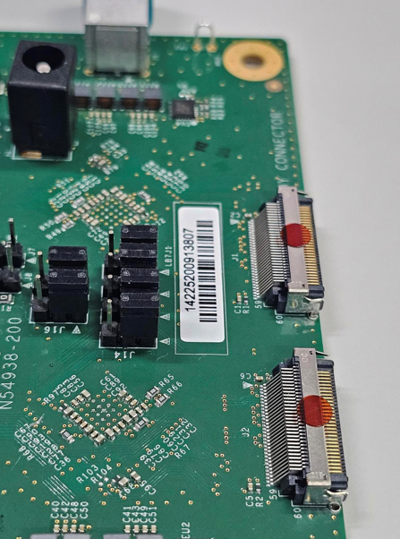
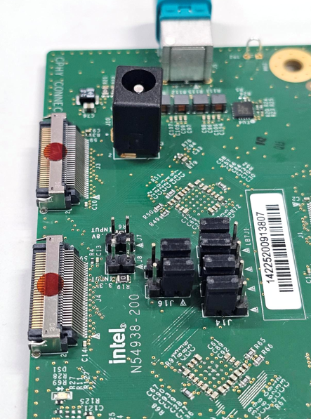
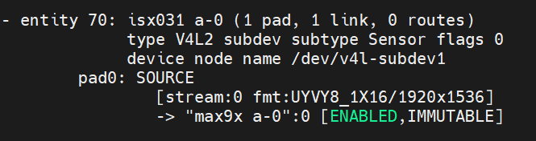

## Description

This document details the configuration settings for the ISX031 GMSL sensor, providing essential information for system integration. The table below presents the key parameters and their respective values used during system setup and validation.

## BIOS Configuration Table

> **Note:** No External Clock required.

### Disable C States

Config path: `Intel Advanced Menu`->`Power & Performance`->`CPU - Power Management Control`

|                            | Options              |
|---                         |---                   |
| C states                   | Disabled             |

> **Note:** : This option is only applicable for IPU6EP platforms (ADL, TWL, ASL and RPL).

### Sensor ACPI HID

| Vendor                     | Sensor ACPI HID      |
|---                         |---                   |
| D3 Embedded                | INTC031M             |
| Leopard Imaging            | INTC031L             |
| Otobrite                   | INTC031O             |
| Sensing                    | INTC031S             |

> **Note:** Sensor ACPI HID value will be used for `MIPI Camera Configuration`.

### MIPI Camera Configuration for IPU6EP

Config path: `Intel Advanced Menu`->`System Agent (SA) Configuration`->`MIPI Camera Configuration`

|                            | Camera1 Link options | Camera2 Link Options |
|---                         |---                   | ---                  |
| Sensor Model               | User Custom          | User Custom          |
| Custom HID                 | <sensor_acpi_hid>    | <sensor_acpi_hid>    |
| Lanes Clock division       | 4 4 2 2              | 4 4 2 2              |
| CRD Version                | CRD-D                | CRD-D                |
| GPIO control               | No Control Logic     | No Control Logic     |
| Camera position            | Front                | Back                 |
| Flash Support              | Disabled             | Disabled             |
| Privacy LED                | Driver default       | Driver default       |
| Rotation                   | 90                   | 90                   |
| PPR Value                  | 2                    | 2                    |
| PPR Unit                   | 2                    | 2                    |
| Camera module name         | _                    | _                    |
| MIPI port                  | 1                    | 2                    |
| LaneUsed                   | x4                   | x4                   |
| PortSpeed                  | 1                    | 2                    |
| MCLK                       | 19200000             | 19200000             |
| EEPROM Type                | ROM_NONE             | ROM_NONE             |
| VCM Type                   | VCM_NONE             | VCM_NONE             |
| Number of I2C Components   | 3                    | 3                    |
| I2C Channel                | I2C1                 | I2C5                 |
| Device 0                   |                      |                      |
| I2C Address                | 48                   | 48                   |
| Device Type                | Sensor               | Sensor               |
| Device 1                   |                      |                      |
| I2C Address                | 44                   | 44                   |
| Device Type                | Sensor               | Sensor               |
| Device 2                   |                      |                      |
| I2C Address                | 50                   | 50                   |
| Device Type                | Sensor               | Sensor               |
| Customize Device ID List   |                      |                      |
| Flash Driver Selection     | Disabled             | Disabled             |

### MIPI Camera Configuration for IPU6EPMTL

Config path: `Intel Advanced Menu`->`System Agent (SA) Configuration`->`MIPI Camera Configuration`

#### Connected to MAX9296 AIC

|                            | Camera1 Link options | Camera2 Link Options |
|---                         |---                   | ---                  |
| Sensor Model               | User Custom          | User Custom          |
| Custom HID                 | <sensor_acpi_hid>    | <sensor_acpi_hid>    |
| Lanes Clock division       | 4 4 2 2              | 4 4 2 2              |
| CRD Version                | CRD-D                | CRD-D                |
| GPIO control               | No Control Logic     | No Control Logic     |
| Camera position            | Front                | Back                 |
| Flash Support              | Disabled             | Disabled             |
| Privacy LED                | Driver default       | Driver default       |
| Rotation                   | 90                   | 90                   |
| PPR Value                  | 2                    | 2                    |
| PPR Unit                   | 2                    | 2                    |
| Camera module name         | _                    | _                    |
| MIPI port                  | 0                    | 4                    |
| LaneUsed                   | x4                   | x4                   |
| MCLK                       | 19200000             | 19200000             |
| EEPROM Type                | ROM_NONE             | ROM_NONE             |
| VCM Type                   | VCM_NONE             | VCM_NONE             |
| Number of I2C Components   | 3                    | 3                    |
| I2C Channel                | I2C1                 | I2C0                 |
| Device 0                   |                      |                      |
| I2C Address                | 48                   | 48                   |
| Device Type                | Sensor               | Sensor               |
| Device 1                   |                      |                      |
| I2C Address                | 44                   | 44                   |
| Device Type                | Sensor               | Sensor               |
| Device 2                   |                      |                      |
| I2C Address                | 50                   | 50                   |
| Device Type                | Sensor               | Sensor               |
| Customize Device ID List   |                      |                      |
| Customize Device ID Number | 17                   | 17                   |
| Customize Device ID Number | 18                   | 18                   |
| Customize Device ID Number | 19                   | 19                   |
| Flash Driver Selection     | Disabled             | Disabled             |

#### Connected to D-PHY of MAX96724 AIC

|                            | Camera1 Link options | Camera2 Link Options |
|---                         |---                   | ---                  |
| Sensor Model               | User Custom          | User Custom          |
| Custom HID                 | <sensor_acpi_hid>    | <sensor_acpi_hid>    |
| Lanes Clock division       | 4 4 2 2              | 4 4 2 2              |
| CRD Version                | CRD-D                | CRD-D                |
| GPIO control               | No Control Logic     | No Control Logic     |
| Camera position            | Front                | Back                 |
| Flash Support              | Disabled             | Disabled             |
| Privacy LED                | Driver default       | Driver default       |
| Rotation                   | 90                   | 180                  |
| PPR Value                  | 4                    | 4                    |
| PPR Unit                   | 4                    | 4                    |
| Camera module name         | _                    | _                    |
| MIPI port                  | 0                    | 4                    |
| LaneUsed                   | x4                   | x4                   |
| MCLK                       | 19200000             | 19200000             |
| EEPROM Type                | ROM_NONE             | ROM_NONE             |
| VCM Type                   | VCM_NONE             | VCM_NONE             |
| Number of I2C Components   | 3                    | 3                    |
| I2C Channel                | I2C1                 | I2C0                 |
| Device 0                   |                      |                      |
| I2C Address                | 27                   | 27                   |
| Device Type                | Sensor               | Sensor               |
| Device 1                   |                      |                      |
| I2C Address                | 44                   | 44                   |
| Device Type                | Sensor               | Sensor               |
| Device 2                   |                      |                      |
| I2C Address                | 50                   | 50                   |
| Device Type                | Sensor               | Sensor               |
| Customize Device ID List   |                      |                      |
| Customize Device ID Number | 17                   | 17                   |
| Customize Device ID Number | 18                   | 18                   |
| Customize Device ID Number | 19                   | 19                   |
| Flash Driver Selection     | Disabled             | Disabled             |

### MIPI Camera Configuration for IPU75XA

Config path: `Intel Advanced Menu`->`System Agent (SA) Configuration`->`MIPI Camera Configuration`

#### Connected to C-PHY of MAX96724 AIC

|                            | Camera1 Link options | Camera2 Link Options |
|---                         |---                   | ---                  |
| Sensor Model               | User Custom          | User Custom          |
| Custom HID                 | <sensor_acpi_hid>    | <sensor_acpi_hid>    |
| Lanes Clock division       | 4 4 2 2              | 4 4 2 2              |
| CRD Version                | CRD-D                | CRD-D                |
| GPIO control               | No Control Logic     | No Control Logic     |
| Camera position            | Front                | Back                 |
| Flash Support              | Disabled             | Disabled             |
| Privacy LED                | Driver default       | Driver default       |
| Rotation                   | 180                  | 0                    |
| Voltage Rail               |                      | 3 voltage rail       |
| PhyConfiguration           | CPHY                 | CPHY                 |
| PPR Value                  | 2                    | 2                    |
| PPR Unit                   | 4                    | 4                    |
| Camera module name         | _                    | _                    |
| MIPI port                  | 0                    | 2                    |
| LaneUsed                   | x4                   | x4                   |
| MCLK                       | 19200000             | 19200000             |
| EEPROM Type                | ROM_NONE             | ROM_NONE             |
| VCM Type                   | VCM_NONE             | VCM_NONE             |
| Number of I2C Components   | 3                    | 3                    |
| I2C Channel                | I2C1                 | I2C2                 |
| Device 0                   |                      |                      |
| I2C Address                | 27                   | 27                   |
| Device Type                | Sensor               | Sensor               |
| Device 1                   |                      |                      |
| I2C Address                | 44                   | 44                   |
| Device Type                | Sensor               | Sensor               |
| Device 2                   |                      |                      |
| I2C Address                | 54                   | 54                   |
| Device Type                | Sensor               | Sensor               |
| Customize Device ID List   |                      |                      |
| Customize Device ID Number | 17                   | 17                   |
| Customize Device ID Number | 18                   | 18                   |
| Customize Device ID Number | 19                   | 19                   |
| Flash Driver Selection     | Disabled             | Disabled             |

#### Connected to D-PHY of MAX96724 AIC (via C-to-D-PHY adaptor)

|                            | Camera1 Link options | Camera2 Link Options |
|---                         |---                   | ---                  |
| Sensor Model               | User Custom          | User Custom          |
| Custom HID                 | <sensor_acpi_hid>    | <sensor_acpi_hid>    |
| Lanes Clock division       | 4 4 2 2              | 4 4 2 2              |
| CRD Version                | CRD-D                | CRD-D                |
| GPIO control               | No Control Logic     | No Control Logic     |
| Camera position            | Front                | Back                 |
| Flash Support              | Disabled             | Disabled             |
| Privacy LED                | Driver default       | Driver default       |
| Rotation                   | 180                  | 0                    |
| Voltage Rail               |                      | 3 voltage rail       |
| PhyConfiguration           | DPHY                 | DPHY                 |
| PPR Value                  | 4                    | 2                    |
| PPR Unit                   | 4                    | 4                    |
| Camera module name         | _                    | _                    |
| MIPI port                  | 0                    | 2                    |
| LaneUsed                   | x4                   | x4                   |
| MCLK                       | 19200000             | 19200000             |
| EEPROM Type                | ROM_NONE             | ROM_NONE             |
| VCM Type                   | VCM_NONE             | VCM_NONE             |
| Number of I2C Components   | 3                    | 3                    |
| I2C Channel                | I2C1                 | I2C2                 |
| Device 0                   |                      |                      |
| I2C Address                | 27                   | 27                   |
| Device Type                | Sensor               | Sensor               |
| Device 1                   |                      |                      |
| I2C Address                | 44                   | 44                   |
| Device Type                | Sensor               | Sensor               |
| Device 2                   |                      |                      |
| I2C Address                | 54                   | 54                   |
| Device Type                | Sensor               | Sensor               |
| Customize Device ID List   |                      |                      |
| Customize Device ID Number | 17                   | 17                   |
| Customize Device ID Number | 18                   | 18                   |
| Customize Device ID Number | 19                   | 19                   |
| Flash Driver Selection     | Disabled             | Disabled             |

## Camera Configuration File Setup

#### Setup for IPU6EP

Replace target system with recommended [ipu6ep](../../config/isx031/ipu6ep) setting

> **Note:** Add config below only if using x1 GMSL sensor.

    sudo cp -r ../../config/isx031/ipu6ep /etc/camera
    sudo sed -i '/availableSensors/c\        <availableSensors value="isx031-1"/>' /etc/camera/ipu6ep/libcamhal_profile.xml

> **Note:** Add config below only if using x4 GMSL sensors.

Please use config from [VTG ipu6ep](https://github.com/intel/ipu6-camera-hal/tree/iotg_ipu6/config/linux/ipu6ep).

#### Setup for IPU6EPMTL

Replace target system with recommended [ipu6epmtl](../../config/isx031/ipu6epmtl) setting

> **Note:** Add config below only if using x1 GMSL sensor.

    sudo cp -r ../../config/isx031/ipu6epmtl /etc/camera
    sudo sed -i '/availableSensors/c\        <availableSensors value="isx031-1"/>' /etc/camera/ipu6epmtl/libcamhal_profile.xml

> **Note:** Add config below only if using x4 GMSL sensors.

Please use config from [VTG ipu6epmtl](https://github.com/intel/ipu6-camera-hal/tree/iotg_ipu6/config/linux/ipu6epmtl).

> **Note:** Add config below only if using x8 GMSL sensors.

    sudo cp -r ../../config/isx031/ipu6epmtl /etc/camera
    sudo sed -i '/availableSensors/c\        <availableSensors value="isx031-8"/>' /etc/camera/ipu6epmtl/libcamhal_profile.xml

#### Setup for IPU75XA

Replace target system with recommended [ipu75xa](../../config/isx031/ipu75xa) setting

> **Note:** Add config below only if using x1 GMSL sensor.

    sudo cp -r ../../config/isx031/ipu75xa /etc/camera
    sudo sed -i '/"availableSensors"/c\                "availableSensors": ["isx031-1-0"],' /etc/camera/ipu75xa/libcamhal_configs.json

> **Note:** Add config below only if using x8 GMSL sensors.

Please use config from [VTG ipu75xa](https://github.com/intel/ipu7-camera-hal/tree/main/config/linux/ipu75xa).

    sudo sed -i '/"availableSensors"/c\                "availableSensors": ["isx031-1-0","isx031-2-0","isx031-3-0","isx031-4-0","isx031-5-2","isx031-6-2","isx031-7-2","isx031-8-2",' /etc/camera/ipu75xa/libcamhal_configs.json

## Environment Setup

Export environment variables below

    export DISPLAY=:0; xhost +
    export GST_PLUGIN_PATH=/usr/lib/gstreamer-1.0
    export LIBVA_DRIVER_NAME=iHD
    export GST_GL_API=gles2
    export GST_GL_PLATFORM=egl
    export LIBVA_DRIVERS_PATH=/usr/lib/x86_64-linux-gnu/dri
    export PKG_CONFIG_PATH=/usr/local/lib/pkgconfig:/usr/lib64/pkgconfig:/usr/lib/pkgconfig
    export LD_LIBRARY_PATH=/usr/local/lib/pkgconfig:/usr/local/lib:/usr/lib64:/usr/lib:/usr/lib/x86_64-linux-gnu
    export logSink=terminal
    rm -rf ~/.cache/gstreamer-1.0

(Required for IPU6 only) Configure isys_freq value

    sudo bash -c 'echo "options intel-ipu6 isys_freq_override=475" >> /etc/modprobe.d/ipu.conf'

## Sensor Verification

Upon setup completion, verify sensor with:

    media-ctl -p

## Sample Userspace Command

#### Sensor Device Selection

| Sensor Number | Command Pipeline |
|---|---|
| 1 | gst-launch-1.0 icamerasrc num-buffers=-1 num-vc=1 scene-mode=normal device-name=isx031-1 printfps=true io-mode=dma_mode ! 'video/x-raw(memory:DMABuf),drm-format=UYVY,width=1920,height=1536' ! glimagesink sync=false |

> **Note**: Refer to icamerasrc device-name property for more sensor details.

##### How to relate Sensor Number with AIC Link Port

| AIC Link Port | Sensor Number |
|---            |---            |
| A             | 1             |
| B             | 2             |

For AIC MAX9296

For AIC MAX96724

#### Frame Buffer Memory Type (IO Mode) Selection

| IO Mode | Command Pipeline |
|---|---|
| MMAP | gst-launch-1.0 icamerasrc num-buffers=-1 num-vc=1 scene-mode=normal device-name=isx031-1 printfps=true io-mode=mmap ! 'video/x-raw,format=UYVY,width=1920,height=1536' ! glimagesink sync=false |
| DMA MODE | gst-launch-1.0 icamerasrc num-buffers=-1 num-vc=1 scene-mode=normal device-name=isx031-1 printfps=true io-mode=dma_mode ! 'video/x-raw(memory:DMABuf),drm-format=UYVY,width=1920,height=1536' ! glimagesink sync=false |

> **Note**: Refer to icamerasrc io-mode property for more sensor details.

#### Sensor Resolution Selection

| Resolution | Command Pipeline |
|---|---|
| 1920x1536 | gst-launch-1.0 icamerasrc num-buffers=-1 num-vc=1 scene-mode=normal device-name=isx031-1 printfps=true io-mode=dma_mode ! 'video/x-raw(memory:DMABuf),drm-format=UYVY,width=1920,height=1536' ! glimagesink sync=false |

#### Sensor Format Selection

| Format | Command Pipeline |
|---|---|
| UYVY | gst-launch-1.0 icamerasrc num-buffers=-1 num-vc=1 scene-mode=normal device-name=isx031-1 printfps=true io-mode=dma_mode ! 'video/x-raw(memory:DMABuf),drm-format=UYVY,width=1920,height=1536' ! glimagesink sync=false |

#### Number of Stream (Single Stream / Multi Stream) Selection

| Number of Stream | Command Pipeline |
|---|---|
| x1 | gst-launch-1.0 icamerasrc num-buffers=-1 num-vc=1 scene-mode=normal device-name=isx031-1 printfps=true io-mode=dma_mode ! 'video/x-raw(memory:DMABuf),drm-format=UYVY,width=1920,height=1536' ! glimagesink sync=false |
| x2 | gst-launch-1.0 icamerasrc num-buffers=-1 num-vc=2 scene-mode=normal device-name=isx031-1 printfps=true io-mode=dma_mode ! 'video/x-raw(memory:DMABuf),drm-format=UYVY,width=1920,height=1536' ! glimagesink sync=false icamerasrc num-buffers=-1 num-vc=2 scene-mode=normal device-name=isx031-2 printfps=true io-mode=dma_mode ! 'video/x-raw(memory:DMABuf),drm-format=UYVY,width=1920,height=1536' ! glimagesink sync=false |
| x4 | gst-launch-1.0 icamerasrc num-buffers=-1 num-vc=4 scene-mode=normal device-name=isx031-1 printfps=true io-mode=dma_mode ! 'video/x-raw(memory:DMABuf),drm-format=UYVY,width=1920,height=1536' ! glimagesink sync=false icamerasrc num-buffers=-1 num-vc=4 scene-mode=normal device-name=isx031-2 printfps=true io-mode=dma_mode ! 'video/x-raw(memory:DMABuf),drm-format=UYVY,width=1920,height=1536' ! glimagesink sync=false icamerasrc num-buffers=-1 num-vc=4 scene-mode=normal device-name=isx031-3 printfps=true io-mode=dma_mode ! 'video/x-raw(memory:DMABuf),drm-format=UYVY,width=1920,height=1536' ! glimagesink sync=false icamerasrc num-buffers=-1 num-vc=4 scene-mode=normal device-name=isx031-4 printfps=true io-mode=dma_mode ! 'video/x-raw(memory:DMABuf),drm-format=UYVY,width=1920,height=1536' ! glimagesink sync=false |
| x8 | gst-launch-1.0 icamerasrc num-buffers=-1 num-vc=8 scene-mode=normal device-name=isx031-1 printfps=true io-mode=dma_mode ! 'video/x-raw(memory:DMABuf),drm-format=UYVY,width=1920,height=1536' ! glimagesink sync=false icamerasrc num-buffers=-1 num-vc=8 scene-mode=normal device-name=isx031-2 printfps=true io-mode=dma_mode ! 'video/x-raw(memory:DMABuf),drm-format=UYVY,width=1920,height=1536' ! glimagesink sync=false icamerasrc num-buffers=-1 num-vc=8 scene-mode=normal device-name=isx031-3 printfps=true io-mode=dma_mode ! 'video/x-raw(memory:DMABuf),drm-format=UYVY,width=1920,height=1536' ! glimagesink sync=false icamerasrc num-buffers=-1 num-vc=8 scene-mode=normal device-name=isx031-4 printfps=true io-mode=dma_mode ! 'video/x-raw(memory:DMABuf),drm-format=UYVY,width=1920,height=1536' ! glimagesink sync=false icamerasrc num-buffers=-1 num-vc=8 scene-mode=normal device-name=isx031-5 printfps=true io-mode=dma_mode ! 'video/x-raw(memory:DMABuf),drm-format=UYVY,width=1920,height=1536' ! glimagesink sync=false icamerasrc num-buffers=-1 num-vc=8 scene-mode=normal device-name=isx031-6 printfps=true io-mode=dma_mode ! 'video/x-raw(memory:DMABuf),drm-format=UYVY,width=1920,height=1536' ! glimagesink sync=false icamerasrc num-buffers=-1 num-vc=8 scene-mode=normal device-name=isx031-7 printfps=true io-mode=dma_mode ! 'video/x-raw(memory:DMABuf),drm-format=UYVY,width=1920,height=1536' ! glimagesink sync=false icamerasrc num-buffers=-1 num-vc=8 scene-mode=normal device-name=isx031-8 printfps=true io-mode=dma_mode ! 'video/x-raw(memory:DMABuf),drm-format=UYVY,width=1920,height=1536' ! glimagesink sync=false |

## Streaming Result

| Number of Stream | IO Mode  | FPS Result |
|---               |---       |---         |
| x1               | MMAP     | 30         |
| x2               | MMAP     | 30         |
| x4               | MMAP     | 30         |
| x8               | MMAP     | 30         |
| x1               | DMA MODE | 30         |
| x2               | DMA MODE | 30         |
| x4               | DMA MODE | 30         |
| x8               | DMA MODE | 30         |

> **Note:** Please ensure your system enable support for specified number of stream before test.
