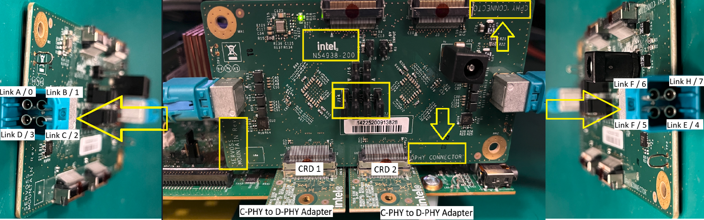

## Description

This document details the configuration settings for the ISX031 GMSL sensor, providing essential information for system integration. The table below presents the key parameters and their respective values used during system setup and validation.

## Table of Contents

- [Hardware Connection](#hardware-connection)
  - [MAX9296 (REV B) Connection](#max9296-rev-b-connection)
  - [MAX96724 AIC (C-PHY) (REV A) Connection](#max96724-aic-c-phy-rev-a-connection)
  - [MAX96724 AIC (C-PHY) (REV B) Connection](#max96724-aic-c-phy-rev-b-connection)
  - [MAX96724 AIC (D-PHY) (REV B) Connection](#max96724-aic-d-phy-rev-b-connection)
  - [MAX96724 AIC (C-PHY to D-PHY Adapter) (REV B) Connection](#max96724-aic-c-phy-to-d-phy-adapter-rev-b-connection)
- [ACPI Setup - BIOS Configuration](#acpi-setup---bios-configuration)
  - [Disable C States](#disable-c-states)
  - [Sensor ACPI HID](#sensor-acpi-hid)
  - [BIOS Settings for IPU6EP](#bios-settings-for-ipu6ep)
  - [BIOS Settings for IPU6EPMTL](#bios-settings-for-ipu6epmtl)
  - [BIOS Settings for IPU75XA](#bios-settings-for-ipu75xa)
  - [BIOS Settings for IPU8](#bios-settings-for-ipu8)
- [ACPI Setup - ASL Configuration](#acpi-setup---asl-configuration)
  - [ASL Configuration for IPU6EPMTL](#asl-configuration-for-ipu6epmtl)
  - [ASL Configuration for IPU75XA](#asl-configuration-for-ipu75xa)
  - [ASL Configuration for IPU8](#asl-configuration-for-ipu8)
- [Libcamhal Configuration File Setup (BIOS configured systems)](#libcamhal-configuration-file-setup-bios-configured-systems)
  - [Libcamhal Config for IPU6EP](#libcamhal-config-for-ipu6ep)
  - [Libcamhal Config for IPU6EPMTL](#libcamhal-config-for-ipu6epmtl)
  - [Libcamhal Config for IPU75XA](#libcamhal-config-for-ipu75xa)
  - [Libcamhal Config for IPU8](#libcamhal-config-for-ipu8)
- [Sensor Verification](#sensor-verification)
- [Supported Configurations](#supported-configurations)
- [Stream Verification](#stream-verification)
  - [Environment Setup](#environment-setup)
  - [Stream with GStreamer icamerasrc](#stream-with-gstreamer-icamerasrc)
    - [device-name Selection](#device-name-selection)
    - [io-mode Selection](#io-mode-selection)
    - [Sensor Resolution Selection](#sensor-resolution-selection)
    - [Sensor Format Selection](#sensor-format-selection)
    - [Number of Streams (Single-Stream / Multi-Stream) Selection](#number-of-streams-single-stream--multi-stream-selection)
- [Streaming Result](#streaming-result)
  - [Highest Bandwidth Configuration](#highest-bandwidth-configuration)

## Hardware Connection

This section describes the physical AIC (Add-In Card) hardware setup, including link port layout and jumper configurations for MIPI PHY selection.

### MAX9296 (REV B) Connection

> **Note:** Samtec cables and an external power supply are required to connect the MAX9296 AIC to the baseboard.

### MAX96724 AIC (C-PHY) (REV A) Connection

> **Note:** The MAX96724 AIC (REV A) supports only C-PHY connections, selectable via the J14 jumper highlighted in the image below.

### MAX96724 AIC (C-PHY) (REV B) Connection

> **Note:** The MAX96724 AIC (REV B) supports both C-PHY and D-PHY connections, selectable via the J14 jumper.

The image below shows the C-PHY setup.

### MAX96724 AIC (D-PHY) (REV B) Connection

> **Note:** Ensure the J14 jumper pins are oriented toward the D-PHY connector, as shown in the image below.

The image below shows the D-PHY setup.

### MAX96724 AIC (C-PHY to D-PHY Adapter) (REV B) Connection

The image below shows the C-PHY to D-PHY adapter setup.

The following sections show the BIOS settings for each platform. Configure the BIOS for the platform in use.

>**Note:** If you want to configure ACPI using ASL, please refer to the [ASL configuration](#acpi-setup---asl-configuration) section below.

---
## ACPI Setup - BIOS Configuration

Using the BIOS configuration exercises the [ipu-acpi](../../drivers/media/platform/intel/) and [max9x](../../drivers/media/i2c/max9x/) drivers.

### Disable C States

Disabling C-states prevents the system from entering low-power states, helping maintain consistent performance and reduce latency during camera operation.

> **Note:** This option applies only to IPU6EP platforms.

>**BIOS path**: `Intel Advanced Menu`->`Power & Performance`->`CPU - Power Management Control` -> C states -> **Disabled**

---
### Sensor ACPI HID

Use the sensor ACPI HID in the **Custom HID** field.

| Vendor          | Sensor ACPI HID |
|-----------------|:---------------:|
| D3 Embedded     | INTC031M        |
| Leopard Imaging | INTC031L        |
| Otobrite        | INTC031O        |
| Sensing         | INTC031S        |

---
### BIOS Settings for IPU6EP

 MAX9296 DPHY + 4x ISX031 

(<a href="#max9296-rev-b-connection">Back to Hardware Setup</a>)

> **Note:** No control logic or external clock is required.

>**BIOS Camera Option 1 Path:**\
 `Intel Advanced Menu`->`System Agent (SA) Configuration`->`MIPI Camera Configuration` -> `Camera Option 1` -> **Enabled**

>**BIOS Camera Option 2 Path:**\
 `Intel Advanced Menu`->`System Agent (SA) Configuration`->`MIPI Camera Configuration` -> `Camera Option 2` -> **Enabled**

|                            | Camera1 Link options | Camera2 Link Options |
|---                         |---                   | ---                  |
| Sensor Model               | User Custom          | User Custom          |
| Custom HID                 | <sensor_acpi_hid>    | <sensor_acpi_hid>    |
| Lanes Clock division       | 4 4 2 2              | 4 4 2 2              |
| CRD Version                | CRD-D                | CRD-D                |
| GPIO control               | No Control Logic     | No Control Logic     |
| Camera position            | Front                | Back                 |
| Flash Support              | Disabled             | Disabled             |
| Privacy LED                | Driver default       | Driver default       |
| Rotation                   | 90                   | 90                   |
| PPR Value                  | 2                    | 2                    |
| PPR Unit                   | 2                    | 2                    |
| Camera module name         | _                    | _                    |
| MIPI port                  | 1                    | 2                    |
| LaneUsed                   | x4                   | x4                   |
| PortSpeed                  | 1                    | 2                    |
| MCLK                       | 19200000             | 19200000             |
| EEPROM Type                | ROM_NONE             | ROM_NONE             |
| VCM Type                   | VCM_NONE             | VCM_NONE             |
| Number of I2C Components   | 3                    | 3                    |
| I2C Channel                | I2C1                 | I2C5                 |
| Device 0                   |                      |                      |
| I2C Address                | 48                   | 48                   |
| Device Type                | Sensor               | Sensor               |
| Device 1                   |                      |                      |
| I2C Address                | 44                   | 44                   |
| Device Type                | Sensor               | Sensor               |
| Device 2                   |                      |                      |
| I2C Address                | 50                   | 50                   |
| Device Type                | Sensor               | Sensor               |
| Customize Device ID List   |                      |                      |
| Flash Driver Selection     | Disabled             | Disabled             |

(<a href="#libcamhal-config-for-ipu6ep">Go to Libcamhal Config</a>)

---
### BIOS Settings for IPU6EPMTL

MAX9296 DPHY + 4x ISX031

(<a href="#max9296-rev-b-connection">Back to Hardware Setup</a>)

>**Connection:**\
 Refer to [MAX9296 (REV B) Connection](#max9296-rev-b-connection) for hardware connection and jumper setup.

> **Note:** No control logic or external clock is required.

>**BIOS Camera Option 1 Path:**\
 `Intel Advanced Menu`->`System Agent (SA) Configuration`->`MIPI Camera Configuration` -> `Camera Option 1` -> **Enabled**

>**BIOS Camera Option 2 Path:**\
 `Intel Advanced Menu`->`System Agent (SA) Configuration`->`MIPI Camera Configuration` -> `Camera Option 2` -> **Enabled**

|                            | Camera1 Link options | Camera2 Link Options |
|---                         |---                   | ---                  |
| Sensor Model               | User Custom          | User Custom          |
| Custom HID                 | <sensor_acpi_hid>    | <sensor_acpi_hid>    |
| Lanes Clock division       | 4 4 2 2              | 4 4 2 2              |
| CRD Version                | CRD-D                | CRD-D                |
| GPIO control               | No Control Logic     | No Control Logic     |
| Camera position            | Front                | Back                 |
| Flash Support              | Disabled             | Disabled             |
| Privacy LED                | Driver default       | Driver default       |
| Rotation                   | 90                   | 90                   |
| PPR Value                  | 2                    | 2                    |
| PPR Unit                   | 2                    | 2                    |
| Camera module name         | _                    | _                    |
| MIPI port                  | 0                    | 4                    |
| LaneUsed                   | x4                   | x4                   |
| MCLK                       | 19200000             | 19200000             |
| EEPROM Type                | ROM_NONE             | ROM_NONE             |
| VCM Type                   | VCM_NONE             | VCM_NONE             |
| Number of I2C Components   | 3                    | 3                    |
| I2C Channel                | I2C1                 | I2C0                 |
| Device 0                   |                      |                      |
| I2C Address                | 48                   | 48                   |
| Device Type                | Sensor               | Sensor               |
| Device 1                   |                      |                      |
| I2C Address                | 44                   | 44                   |
| Device Type                | Sensor               | Sensor               |
| Device 2                   |                      |                      |
| I2C Address                | 50                   | 50                   |
| Device Type                | Sensor               | Sensor               |
| Customize Device ID List   |                      |                      |
| Customize Device ID Number | 17                   | 17                   |
| Customize Device ID Number | 18                   | 18                   |
| Customize Device ID Number | 19                   | 19                   |
| Flash Driver Selection     | Disabled             | Disabled             |

MAX96724 DPHY + 8x ISX031 

(<a href="#max96724-aic-d-phy-rev-b-connection">Back to Hardware Setup</a>)

>**Connection:**\
 Refer to [MAX96724 AIC (D-PHY) (REV B) Connection](#max96724-aic-d-phy-rev-b-connection) for hardware connection and jumper setup.

>**BIOS path:**\
 `Intel Advanced Menu`->`System Agent (SA) Configuration`->`MIPI Camera Configuration`

|                            | Camera1 Link options | Camera2 Link Options |
|---                         |---                   | ---                  |
| Sensor Model               | User Custom          | User Custom          |
| Custom HID                 | <sensor_acpi_hid>    | <sensor_acpi_hid>    |
| Lanes Clock division       | 4 4 2 2              | 4 4 2 2              |
| CRD Version                | CRD-D                | CRD-D                |
| GPIO control               | No Control Logic     | No Control Logic     |
| Camera position            | Front                | Back                 |
| Flash Support              | Disabled             | Disabled             |
| Privacy LED                | Driver default       | Driver default       |
| Rotation                   | 90                   | 180                  |
| PPR Value                  | 4                    | 4                    |
| PPR Unit                   | 4                    | 4                    |
| Camera module name         | _                    | _                    |
| MIPI port                  | 0                    | 4                    |
| LaneUsed                   | x4                   | x4                   |
| MCLK                       | 19200000             | 19200000             |
| EEPROM Type                | ROM_NONE             | ROM_NONE             |
| VCM Type                   | VCM_NONE             | VCM_NONE             |
| Number of I2C Components   | 3                    | 3                    |
| I2C Channel                | I2C1                 | I2C0                 |
| Device 0                   |                      |                      |
| I2C Address                | 27                   | 27                   |
| Device Type                | Sensor               | Sensor               |
| Device 1                   |                      |                      |
| I2C Address                | 44                   | 44                   |
| Device Type                | Sensor               | Sensor               |
| Device 2                   |                      |                      |
| I2C Address                | 50                   | 50                   |
| Device Type                | Sensor               | Sensor               |
| Customize Device ID List   |                      |                      |
| Customize Device ID Number | 17                   | 17                   |
| Customize Device ID Number | 18                   | 18                   |
| Customize Device ID Number | 19                   | 19                   |
| Flash Driver Selection     | Disabled             | Disabled             |

(<a href="#libcamhal-config-for-ipu6epmtl">Go to Libcamhal Config</a>)

---
### BIOS Settings for IPU75XA

MAX96724 CPHY + 8x ISX031

(<a href="#max96724-aic-c-phy-rev-b-connection">Back to Hardware Setup</a>)

>**Connection:**\
 Refer to [MAX96724 AIC (C-PHY) (REV B) Connection](#max96724-aic-c-phy-rev-b-connection) for hardware connection and jumper setup.

> **Note:** No control logic or external clock is required.

>**BIOS Camera Option 1 Path:**\
 `Intel Advanced Menu`->`System Agent (SA) Configuration`->`MIPI Camera Configuration` -> `Camera Option 1` -> **Enabled**

>**BIOS Camera Option 2 Path:**\
 `Intel Advanced Menu`->`System Agent (SA) Configuration`->`MIPI Camera Configuration` -> `Camera Option 2` -> **Enabled**

|                            | Camera1 Link options | Camera2 Link Options |
|---                         |---                   | ---                  |
| Sensor Model               | User Custom          | User Custom          |
| Custom HID                 | <sensor_acpi_hid>    | <sensor_acpi_hid>    |
| Lanes Clock division       | 4 4 2 2              | 4 4 2 2              |
| CRD Version                | CRD-D                | CRD-D                |
| GPIO control               | No Control Logic     | No Control Logic     |
| Camera position            | Front                | Back                 |
| Flash Support              | Disabled             | Disabled             |
| Privacy LED                | Driver default       | Driver default       |
| Rotation                   | 180                  | 0                    |
| Voltage Rail               |                      | 3 voltage rail       |
| PhyConfiguration           | CPHY                 | CPHY                 |
| PPR Value                  | 2                    | 2                    |
| PPR Unit                   | 4                    | 4                    |
| Camera module name         | _                    | _                    |
| MIPI port                  | 0                    | 2                    |
| LaneUsed                   | x4                   | x4                   |
| MCLK                       | 19200000             | 19200000             |
| EEPROM Type                | ROM_NONE             | ROM_NONE             |
| VCM Type                   | VCM_NONE             | VCM_NONE             |
| Number of I2C Components   | 3                    | 3                    |
| I2C Channel                | I2C1                 | I2C2                 |
| Device 0                   |                      |                      |
| I2C Address                | 27                   | 27                   |
| Device Type                | Sensor               | Sensor               |
| Device 1                   |                      |                      |
| I2C Address                | 44                   | 44                   |
| Device Type                | Sensor               | Sensor               |
| Device 2                   |                      |                      |
| I2C Address                | 54                   | 54                   |
| Device Type                | Sensor               | Sensor               |
| Customize Device ID List   |                      |                      |
| Customize Device ID Number | 17                   | 17                   |
| Customize Device ID Number | 18                   | 18                   |
| Customize Device ID Number | 19                   | 19                   |
| Flash Driver Selection     | Disabled             | Disabled             |

MAX96724 DPHY (via C-to-D-PHY adapter) + 6x ISX031 

(<a href="#max96724-aic-c-phy-to-d-phy-adapter-rev-b-connection">Back to Hardware Setup</a>)

>**Connection:**\
 Refer to [MAX96724 AIC DPHY (via C-PHY to D-PHY Adapter) (REV B) Connection](#max96724-aic-c-phy-to-d-phy-adapter-rev-b-connection) for hardware connection and jumper setup.

>**BIOS path:**\
 `Intel Advanced Menu`->`System Agent (SA) Configuration`->`MIPI Camera Configuration`

Click to expand BIOS camera link options

|                            | Camera1 Link options | Camera2 Link Options |
|---                         |---                   | ---                  |
| Sensor Model               | User Custom          | User Custom          |
| Custom HID                 | <sensor_acpi_hid>    | <sensor_acpi_hid>    |
| Lanes Clock division       | 4 4 2 2              | 4 4 2 2              |
| CRD Version                | CRD-D                | CRD-D                |
| GPIO control               | No Control Logic     | No Control Logic     |
| Camera position            | Front                | Back                 |
| Flash Support              | Disabled             | Disabled             |
| Privacy LED                | Driver default       | Driver default       |
| Rotation                   | 180                  | 0                    |
| Voltage Rail               |                      | 3 voltage rail       |
| PhyConfiguration           | DPHY                 | DPHY                 |
| PPR Value                  | 4                    | 2                    |
| PPR Unit                   | 4                    | 4                    |
| Camera module name         | _                    | _                    |
| MIPI port                  | 0                    | 2                    |
| LaneUsed                   | x4                   | x4                   |
| MCLK                       | 19200000             | 19200000             |
| EEPROM Type                | ROM_NONE             | ROM_NONE             |
| VCM Type                   | VCM_NONE             | VCM_NONE             |
| Number of I2C Components   | 3                    | 3                    |
| I2C Channel                | I2C1                 | I2C2                 |
| Device 0                   |                      |                      |
| I2C Address                | 27                   | 27                   |
| Device Type                | Sensor               | Sensor               |
| Device 1                   |                      |                      |
| I2C Address                | 44                   | 44                   |
| Device Type                | Sensor               | Sensor               |
| Device 2                   |                      |                      |
| I2C Address                | 54                   | 54                   |
| Device Type                | Sensor               | Sensor               |
| Customize Device ID List   |                      |                      |
| Customize Device ID Number | 17                   | 17                   |
| Customize Device ID Number | 18                   | 18                   |
| Customize Device ID Number | 19                   | 19                   |
| Flash Driver Selection     | Disabled             | Disabled             |

(<a href="#libcamhal-config-for-ipu75xa">Go to Libcamhal Config</a>)

---
### BIOS Settings for IPU8

MAX96724 CPHY + 8x ISX031

(<a href="#max96724-aic-c-phy-rev-a-connection">Back to Hardware Setup</a>)

>**Connection:**\
 Refer to [MAX96724 AIC (C-PHY) (REV A) Connection](#max96724-aic-c-phy-rev-a-connection) for hardware connection and jumper setup.

> **Note:** No control logic or external clock is required.

>**BIOS Camera Option 1 Path:**\
 `Intel Advanced Menu`->`System Agent (SA) Configuration`->`MIPI Camera Configuration` -> `Camera Option 1` -> **Enabled**

>**BIOS Camera Option 2 Path:**\
 `Intel Advanced Menu`->`System Agent (SA) Configuration`->`MIPI Camera Configuration` -> `Camera Option 2` -> **Enabled**

|                            | Camera1 Link options | Camera2 Link Options |
|---                         |---                   | ---                  |
| Sensor Model               | User Custom          | User Custom          |
| Custom HID                 | <sensor_acpi_hid>    | <sensor_acpi_hid>    |
| Lanes Clock division       | 4 4 2 2              | 4 4 2 2              |
| CRD Version                | CRD-D                | CRD-D                |
| GPIO control               | No Control Logic     | No Control Logic     |
| Camera position            | Front                | Back                 |
| Flash Support              | Disabled             | Disabled             |
| Privacy LED                | Driver default       | Driver default       |
| Rotation                   | 180                  | 0                    |
| Voltage Rail               |                      | 3 voltage rail       |
| PPR Value                  | 2                    | 2                    |
| PPR Unit                   | 4                    | 4                    |
| PhyConfiguration           | CPHY                 | CPHY                 |
| Camera module name         | MAX96724             | MAX96724             |
| MIPI port                  | 0                    | 2                    |
| LaneUsed                   | x4                   | x4                   |
| MCLK                       | 19200000             | 19200000             |
| EEPROM Type                | ROM_NONE             | ROM_NONE             |
| VCM Type                   | VCM_NONE             | VCM_NONE             |
| Number of I2C Components   | 3                    | 3                    |
| I2C Channel                | I2C1                 | I2C0                 |
| Device 0                   |                      |                      |
| I2C Address                | 27                   | 27                   |
| Device Type                | Sensor               | Sensor               |
| Device 1                   |                      |                      |
| I2C Address                | 44                   | 44                   |
| Device Type                | Sensor               | Sensor               |
| Device 2                   |                      |                      |
| I2C Address                | 54                   | 54                   |
| Device Type                | Sensor               | Sensor               |
| Customize Device ID List   |                      |                      |
| Customize Device ID Number | 17                   | 17                   |
| Customize Device ID Number | 18                   | 18                   |
| Customize Device ID Number | 19                   | 19                   |
| Flash Driver Selection     | Disabled             | Disabled             |

(<a href="#libcamhal-config-for-ipu8">Go to Libcamhal Config</a>)

---
## ACPI Setup - ASL Configuration

<h3>IMPORTANT: Turn off the BIOS setting to use the ASL method.</h3>

Using the ASL configuration exercises the [maxim-serdes](../../drivers/media/i2c/maxim-serdes/) drivers.

To compile ASL and load an SSDT overlay image, refer to [acpi/kernelspace.md](../acpi/kernelspace.md#compile-and-load).

---
### ASL Configuration for IPU6EPMTL

 MAX9296 DPHY + 4x D3 ISX031 GMSL sensor use case 

(<a href="#max9296-rev-b-connection">Back to Hardware Setup</a>)

>**ASL:** [max9296_d3_isx031.asl](../../acpi/ipu6/max9296_d3_isx031.asl)\

 MAX9296 DPHY + 1x LI ISX031 GMSL sensor use case 

(<a href="#max9296-rev-b-connection">Back to Hardware Setup</a>)

>**ASL:** [max9296_li_isx031.asl](../../acpi/ipu6/max9296_li_isx031.asl)\

 MAX9296 DPHY + 1x Sensing ISX031 GMSL sensor use case 

(<a href="#max9296-rev-b-connection">Back to Hardware Setup</a>)

>**ASL:** [max9296_sensing_isx031.asl](../../acpi/ipu6/max9296_sensing_isx031.asl)\

 MAX96724 DPHY + 8x D3 ISX031 GMSL sensor use case 

(<a href="#max96724-aic-d-phy-rev-b-connection">Back to Hardware Setup</a>)

>**ASL:** [max96724_dphy_d3_isx031.asl](../../acpi/ipu6/max96724_dphy_d3_isx031.asl)\

(<a href="../acpi/userspace-gmsl.md#construct-pipeline">Go to Pipeline Configuration</a>)

---
### ASL Configuration for IPU75XA

 MAX96724 CPHY + 8x D3 ISX031 GMSL sensor use case 

(<a href="#max96724-aic-c-phy-rev-b-connection">Back to Hardware Setup</a>)

>**ASL:** [max96724_d3_isx031.asl](../../acpi/ipu7/max96724_d3_isx031.asl)\

 MAX96724 CPHY + 1x LI ISX031 GMSL sensor use case 

(<a href="#max96724-aic-c-phy-rev-b-connection">Back to Hardware Setup</a>)

>**ASL:** [max96724_li_isx031.asl](../../acpi/ipu7/max96724_li_isx031.asl)\

 MAX96724 CPHY + 1x Sensing ISX031 GMSL sensor use case 

(<a href="#max96724-aic-c-phy-rev-b-connection">Back to Hardware Setup</a>)

>**ASL:** [max96724_sensing_isx031.asl](../../acpi/ipu7/max96724_sensing_isx031.asl)\

 MAX96724 DPHY + 6x D3 ISX031 GMSL sensor use case 

(<a href="#max96724-aic-d-phy-rev-b-connection">Back to Hardware Setup</a>)

>**ASL:** [max96724_dphy_d3_isx031.asl](../../acpi/ipu7/max96724_dphy_d3_isx031.asl)\

(<a href="../acpi/userspace-gmsl.md#construct-pipeline">Go to Pipeline Configuration</a>)

---
### ASL Configuration for IPU8

 MAX96724 CPHY + 8x D3 ISX031 GMSL sensor use case 

(<a href="#max96724-aic-c-phy-rev-b-connection">Back to Hardware Setup</a>)

>**ASL:** [max96724_d3_isx031.asl](../../acpi/ipu8/max96724_d3_isx031.asl)\

 MAX96724 CPHY + 1x LI ISX031 GMSL sensor use case 

(<a href="#max96724-aic-c-phy-rev-b-connection">Back to Hardware Setup</a>)

>**ASL:** [max96724_li_isx031.asl](../../acpi/ipu8/max96724_li_isx031.asl)\

 MAX96724 CPHY + 1x Sensing ISX031 GMSL sensor use case 

(<a href="#max96724-aic-c-phy-rev-b-connection">Back to Hardware Setup</a>)

>**ASL:** [max96724_sensing_isx031.asl](../../acpi/ipu8/max96724_sensing_isx031.asl)\

 MAX96724 DPHY + 6x D3 ISX031 GMSL sensor use case 

(<a href="#max96724-aic-d-phy-rev-b-connection">Back to Hardware Setup</a>)

>**ASL:** [max96724_dphy_d3_isx031.asl](../../acpi/ipu8/max96724_dphy_d3_isx031.asl)\

(<a href="../acpi/userspace-gmsl.md#construct-pipeline">Go to Pipeline Configuration</a>)

---
## Libcamhal Configuration File Setup (BIOS-Configured Systems)

**Note:**\
For ASL-configured systems, refer to [acpi/userspace-gmsl.md](../acpi/userspace-gmsl.md#stream-verification) for the libcamhal configuration file setup.

#### Libcamhal Config for IPU6EP

1x GMSL sensor use case 

Please use recommended config from [ipu6ep](../../config/isx031/ipu6ep).

> **Note:** Add config below only if using 1x GMSL sensor.

    sudo cp -r ../../config/isx031/ipu6ep /etc/camera
    sudo sed -i '/availableSensors/c\        <availableSensors value="isx031-1-1"/>' /etc/camera/ipu6ep/libcamhal_profile.xml

4x GMSL sensor use case 

**BIOS configuration:** [IPU6EP 4x GMSL sensor use case](#bios-settings-for-ipu6ep)

Please use config from [VTG ipu6ep](https://github.com/intel/ipu6-camera-hal/tree/iotg_ipu6/config/linux/ipu6ep).

(<a href="#sensor-verification">Go to Sensor Verification</a>)

(<a href="#stream-verification">Go to Stream Verification</a>)

---
#### Libcamhal Config for IPU6EPMTL

1x GMSL sensor use case 

Please use config from [ipu6epmtl](../../config/isx031/ipu6epmtl).

> **Note:** Add config below only if using 1x GMSL sensor.

    sudo cp -r ../../config/isx031/ipu6epmtl /etc/camera
    sudo sed -i '/availableSensors/c\        <availableSensors value="isx031-1"/>' /etc/camera/ipu6epmtl/libcamhal_profile.xml

4x GMSL sensor use case 

Please use config from [VTG ipu6epmtl](https://github.com/intel/ipu6-camera-hal/tree/iotg_ipu6/config/linux/ipu6epmtl).

8x GMSL sensor use case 

Please use config from [ipu6epmtl](../../config/isx031/ipu6epmtl).

> **Note:** Add config below only if using 8x GMSL sensors.

    sudo cp -r ../../config/isx031/ipu6epmtl /etc/camera
    sudo sed -i '/availableSensors/c\        <availableSensors value="isx031-8"/>' /etc/camera/ipu6epmtl/libcamhal_profile.xml

  
(<a href="#sensor-verification">Go to Sensor Verification</a>)

  
(<a href="#stream-verification">Go to Stream Verification</a>)

---
#### Libcamhal Config for IPU75XA

1x GMSL sensor use case 

Please use recommended config from [ipu75xa](../../config/isx031/ipu75xa).

> **Note:** Add config below only if using 1x GMSL sensor.

    sudo cp -r ../../config/isx031/ipu75xa /etc/camera
    sudo sed -i '/"availableSensors"/c\                "availableSensors": ["isx031-1-0"],' /etc/camera/ipu75xa/libcamhal_configs.json

8x GMSL sensor use case 

> **Note:** Add config below only if using 8x GMSL sensors.

Please use config from [VTG ipu75xa](https://github.com/intel/ipu7-camera-hal/tree/main/config/linux/ipu75xa).

(<a href="#sensor-verification">Go to Sensor Verification</a>)

(<a href="#stream-verification">Go to Stream Verification</a>)

---
#### Libcamhal Config for IPU8

1x GMSL sensor use case 

Please use recommended config from [ipu8](../../config/isx031/ipu8).

> **Note:** Add config below only if using 1x GMSL sensor.

    sudo cp -r ../../config/isx031/ipu8 /etc/camera
    sudo sed -i '/"availableSensors"/c\                "availableSensors": ["isx031-1-0"],' /etc/camera/ipu8/libcamhal_configs.json

8x GMSL sensor use case 

> **Note:** Add config below only if using 8x GMSL sensors.

Please use config from [VTG ipu8](https://github.com/intel/ipu7-camera-hal/tree/main/config/linux/ipu8).

(<a href="#sensor-verification">Go to Sensor Verification</a>)

(<a href="#stream-verification">Go to Stream Verification</a>)

---
## Sensor Verification

After completing the setup, verify that the sensor is probed and registered with the V4L2 framework:

    media-ctl -p

When using the BIOS configuration, the output for a single camera should look like the example below.

---
## Supported Configurations

| Format | Resolution | Frame Rate |
|---|---|---|
| UYVY8_1X16 | 1920x1536 | 60, 30 |
|            | 1920x1080 | 60, 30 (default) |
|            | 1280x720  | 30 |

---
## Stream Verification

> **Note:** \
> For an ASL-configured system, refer to [acpi/userspace-gmsl.md](../acpi/userspace-gmsl.md) for pipeline setup and stream verification commands.

### Environment Setup

Export the environment variables below:

    unset XDG_RUNTIME_DIR
    export DISPLAY=:0; xhost +
    export GST_PLUGIN_PATH=/usr/lib/gstreamer-1.0
    export LIBVA_DRIVER_NAME=iHD
    export GST_GL_API=gles2
    export GST_GL_PLATFORM=egl
    export LIBVA_DRIVERS_PATH=/usr/lib/x86_64-linux-gnu/dri
    export PKG_CONFIG_PATH=/usr/local/lib/pkgconfig:/usr/lib64/pkgconfig:/usr/lib/pkgconfig
    export LD_LIBRARY_PATH=/usr/local/lib/pkgconfig:/usr/local/lib:/usr/lib64:/usr/lib:/usr/lib/x86_64-linux-gnu
    export logSink=terminal
    rm -rf ~/.cache/gstreamer-1.0

For IPU6 only, configure the `isys_freq` value:

    sudo bash -c 'echo "options intel-ipu6 isys_freq_override=475" >> /etc/modprobe.d/ipu.conf'

---
### Stream with GStreamer icamerasrc

#### device-name Selection

| AIC Link | Supported Device-name | Command Pipeline |
|:--------:|:---------------------:|------------------|
| A        | isx031-1              | gst-launch-1.0 icamerasrc num-buffers=-1 num-vc=1 scene-mode=normal device-name=isx031-1 printfps=true io-mode=dma_mode ! 'video/x-raw(memory:DMABuf),drm-format=UYVY,width=1920,height=1536' ! glimagesink sync=false |
| B        | isx031-2              | gst-launch-1.0 icamerasrc num-buffers=-1 num-vc=1 scene-mode=normal device-name=isx031-2 printfps=true io-mode=dma_mode ! 'video/x-raw(memory:DMABuf),drm-format=UYVY,width=1920,height=1536' ! glimagesink sync=false |
| C        | isx031-3              | gst-launch-1.0 icamerasrc num-buffers=-1 num-vc=1 scene-mode=normal device-name=isx031-3 printfps=true io-mode=dma_mode ! 'video/x-raw(memory:DMABuf),drm-format=UYVY,width=1920,height=1536' ! glimagesink sync=false |
| D        | isx031-4              | gst-launch-1.0 icamerasrc num-buffers=-1 num-vc=1 scene-mode=normal device-name=isx031-4 printfps=true io-mode=dma_mode ! 'video/x-raw(memory:DMABuf),drm-format=UYVY,width=1920,height=1536' ! glimagesink sync=false |
| E        | isx031-5              | gst-launch-1.0 icamerasrc num-buffers=-1 num-vc=1 scene-mode=normal device-name=isx031-5 printfps=true io-mode=dma_mode ! 'video/x-raw(memory:DMABuf),drm-format=UYVY,width=1920,height=1536' ! glimagesink sync=false |
| F        | isx031-6              | gst-launch-1.0 icamerasrc num-buffers=-1 num-vc=1 scene-mode=normal device-name=isx031-6 printfps=true io-mode=dma_mode ! 'video/x-raw(memory:DMABuf),drm-format=UYVY,width=1920,height=1536' ! glimagesink sync=false |
| G        | isx031-7              | gst-launch-1.0 icamerasrc num-buffers=-1 num-vc=1 scene-mode=normal device-name=isx031-7 printfps=true io-mode=dma_mode ! 'video/x-raw(memory:DMABuf),drm-format=UYVY,width=1920,height=1536' ! glimagesink sync=false |
| H        | isx031-8              | gst-launch-1.0 icamerasrc num-buffers=-1 num-vc=1 scene-mode=normal device-name=isx031-8 printfps=true io-mode=dma_mode ! 'video/x-raw(memory:DMABuf),drm-format=UYVY,width=1920,height=1536' ! glimagesink sync=false |

> **Note:** Link ports E, F, G, and H apply only to the MAX96724 AIC.

> **Note:** Refer to the icamerasrc `device-name` property for more sensor details.

---
#### io-mode Selection

| IO Mode | Command Pipeline |
|---|---|
| MMAP | gst-launch-1.0 icamerasrc num-buffers=-1 num-vc=1 scene-mode=normal device-name=isx031-1 printfps=true io-mode=mmap ! 'video/x-raw,format=UYVY,width=1920,height=1536' ! glimagesink sync=false |
| DMA MODE | gst-launch-1.0 icamerasrc num-buffers=-1 num-vc=1 scene-mode=normal device-name=isx031-1 printfps=true io-mode=dma_mode ! 'video/x-raw(memory:DMABuf),drm-format=UYVY,width=1920,height=1536' ! glimagesink sync=false |

> **Note:** Refer to the icamerasrc `io-mode` property for more sensor details.

---
#### Sensor Resolution Selection

| Resolution | Command Pipeline |
|---|---|
| 1920x1536 | gst-launch-1.0 icamerasrc num-buffers=-1 num-vc=1 scene-mode=normal device-name=isx031-1 printfps=true io-mode=dma_mode ! 'video/x-raw(memory:DMABuf),drm-format=UYVY,width=1920,height=1536' ! glimagesink sync=false |
| 1920x1080 | gst-launch-1.0 icamerasrc num-buffers=-1 num-vc=1 scene-mode=normal device-name=isx031-1 printfps=true io-mode=dma_mode ! 'video/x-raw(memory:DMABuf),drm-format=UYVY,width=1920,height=1080' ! glimagesink sync=false |
| 1280x720 | gst-launch-1.0 icamerasrc num-buffers=-1 num-vc=1 scene-mode=normal device-name=isx031-1 printfps=true io-mode=dma_mode ! 'video/x-raw(memory:DMABuf),drm-format=UYVY,width=1280,height=720' ! glimagesink sync=false |

(<a href="#supported-configurations">Back to Supported Configurations</a>)

---
#### Sensor Format Selection

| Format | Command Pipeline |
|---|---|
| UYVY | gst-launch-1.0 icamerasrc num-buffers=-1 num-vc=1 scene-mode=normal device-name=isx031-1 printfps=true io-mode=dma_mode ! 'video/x-raw(memory:DMABuf),drm-format=UYVY,width=1920,height=1536' ! glimagesink sync=false |

(<a href="#supported-configurations">Back to Supported Configurations</a>)

---
#### Number of Streams (Single-Stream / Multi-Stream) Selection

| Number of Stream | Command Pipeline |
|---|---|
| x1 | gst-launch-1.0 icamerasrc num-buffers=-1 num-vc=1 scene-mode=normal device-name=isx031-1 printfps=true io-mode=dma_mode ! 'video/x-raw(memory:DMABuf),drm-format=UYVY,width=1920,height=1536' ! glimagesink sync=false |
| x2 | gst-launch-1.0 icamerasrc num-buffers=-1 num-vc=2 scene-mode=normal device-name=isx031-1 printfps=true io-mode=dma_mode ! 'video/x-raw(memory:DMABuf),drm-format=UYVY,width=1920,height=1536' ! glimagesink sync=false icamerasrc num-buffers=-1 num-vc=2 scene-mode=normal device-name=isx031-2 printfps=true io-mode=dma_mode ! 'video/x-raw(memory:DMABuf),drm-format=UYVY,width=1920,height=1536' ! glimagesink sync=false |
| x4 | gst-launch-1.0 icamerasrc num-buffers=-1 num-vc=4 scene-mode=normal device-name=isx031-1 printfps=true io-mode=dma_mode ! 'video/x-raw(memory:DMABuf),drm-format=UYVY,width=1920,height=1536' ! glimagesink sync=false icamerasrc num-buffers=-1 num-vc=4 scene-mode=normal device-name=isx031-2 printfps=true io-mode=dma_mode ! 'video/x-raw(memory:DMABuf),drm-format=UYVY,width=1920,height=1536' ! glimagesink sync=false icamerasrc num-buffers=-1 num-vc=4 scene-mode=normal device-name=isx031-3 printfps=true io-mode=dma_mode ! 'video/x-raw(memory:DMABuf),drm-format=UYVY,width=1920,height=1536' ! glimagesink sync=false icamerasrc num-buffers=-1 num-vc=4 scene-mode=normal device-name=isx031-4 printfps=true io-mode=dma_mode ! 'video/x-raw(memory:DMABuf),drm-format=UYVY,width=1920,height=1536' ! glimagesink sync=false |
| x6 | gst-launch-1.0 icamerasrc num-buffers=-1 num-vc=6 scene-mode=normal device-name=isx031-1 printfps=true io-mode=dma_mode ! 'video/x-raw(memory:DMABuf),drm-format=UYVY,width=1920,height=1536' ! glimagesink sync=false icamerasrc num-buffers=-1 num-vc=6 scene-mode=normal device-name=isx031-2 printfps=true io-mode=dma_mode ! 'video/x-raw(memory:DMABuf),drm-format=UYVY,width=1920,height=1536' ! glimagesink sync=false icamerasrc num-buffers=-1 num-vc=6 scene-mode=normal device-name=isx031-3 printfps=true io-mode=dma_mode ! 'video/x-raw(memory:DMABuf),drm-format=UYVY,width=1920,height=1536' ! glimagesink sync=false icamerasrc num-buffers=-1 num-vc=6 scene-mode=normal device-name=isx031-4 printfps=true io-mode=dma_mode ! 'video/x-raw(memory:DMABuf),drm-format=UYVY,width=1920,height=1536' ! glimagesink sync=false icamerasrc num-buffers=-1 num-vc=6 scene-mode=normal device-name=isx031-5 printfps=true io-mode=dma_mode ! 'video/x-raw(memory:DMABuf),drm-format=UYVY,width=1920,height=1536' ! glimagesink sync=false icamerasrc num-buffers=-1 num-vc=6 scene-mode=normal device-name=isx031-6 printfps=true io-mode=dma_mode ! 'video/x-raw(memory:DMABuf),drm-format=UYVY,width=1920,height=1536' ! glimagesink sync=false |
| x8 | gst-launch-1.0 icamerasrc num-buffers=-1 num-vc=8 scene-mode=normal device-name=isx031-1 printfps=true io-mode=dma_mode ! 'video/x-raw(memory:DMABuf),drm-format=UYVY,width=1920,height=1536' ! glimagesink sync=false icamerasrc num-buffers=-1 num-vc=8 scene-mode=normal device-name=isx031-2 printfps=true io-mode=dma_mode ! 'video/x-raw(memory:DMABuf),drm-format=UYVY,width=1920,height=1536' ! glimagesink sync=false icamerasrc num-buffers=-1 num-vc=8 scene-mode=normal device-name=isx031-3 printfps=true io-mode=dma_mode ! 'video/x-raw(memory:DMABuf),drm-format=UYVY,width=1920,height=1536' ! glimagesink sync=false icamerasrc num-buffers=-1 num-vc=8 scene-mode=normal device-name=isx031-4 printfps=true io-mode=dma_mode ! 'video/x-raw(memory:DMABuf),drm-format=UYVY,width=1920,height=1536' ! glimagesink sync=false icamerasrc num-buffers=-1 num-vc=8 scene-mode=normal device-name=isx031-5 printfps=true io-mode=dma_mode ! 'video/x-raw(memory:DMABuf),drm-format=UYVY,width=1920,height=1536' ! glimagesink sync=false icamerasrc num-buffers=-1 num-vc=8 scene-mode=normal device-name=isx031-6 printfps=true io-mode=dma_mode ! 'video/x-raw(memory:DMABuf),drm-format=UYVY,width=1920,height=1536' ! glimagesink sync=false icamerasrc num-buffers=-1 num-vc=8 scene-mode=normal device-name=isx031-7 printfps=true io-mode=dma_mode ! 'video/x-raw(memory:DMABuf),drm-format=UYVY,width=1920,height=1536' ! glimagesink sync=false icamerasrc num-buffers=-1 num-vc=8 scene-mode=normal device-name=isx031-8 printfps=true io-mode=dma_mode ! 'video/x-raw(memory:DMABuf),drm-format=UYVY,width=1920,height=1536' ! glimagesink sync=false |

## Streaming Result

| Number of Stream | IO Mode  | FPS Result |ipu6ep|ipu6epmtl|ipu75xa|ipu8|
|:----------------:|:--------:|:----------:|:----:|:-------:|:-----:|:--:|
| x1               | MMAP     | 30         |✅|✅|✅|✅|
| x2               | MMAP     | 30         |✅|✅|✅|✅|
| x4               | MMAP     | 30         |✅|✅|✅|✅|
| x6               | DMA MODE | 30         |❌|❌|✅|✅|
| x8               | MMAP     | 30         |❌|✅|✅|✅|
| x1               | DMA MODE | 30         |✅|✅|✅|✅|
| x2               | DMA MODE | 30         |✅|✅|✅|✅|
| x4               | DMA MODE | 30         |✅|✅|✅|✅|
| x6               | DMA MODE | 30         |❌|❌|✅|✅|
| x8               | DMA MODE | 30         |❌|✅|✅|✅|

> **Note:** Ensure that the system supports the specified number of streams before testing.

### Highest Bandwidth Configuration

The highest-bandwidth configurations tested are listed below.

  1. DPHY 4-lane per MIPI Port
     - 4x 1920x1536 @ 30fps (default)
     - 3x 1920x1536 @ 60fps

  2. DPHY 2-lane per MIPI Port
     - 2x 1920x1536 @ 30fps (default)

  3. CPHY 2-trio per MIPI Port
     - 4x 1920x1536 @ 30fps (default)
     - 3x 1920x1536 @ 60fps
